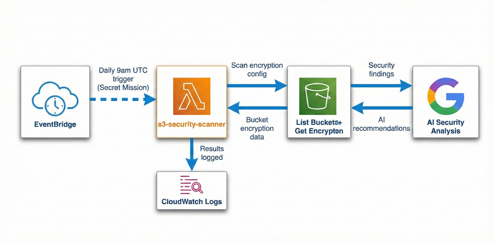
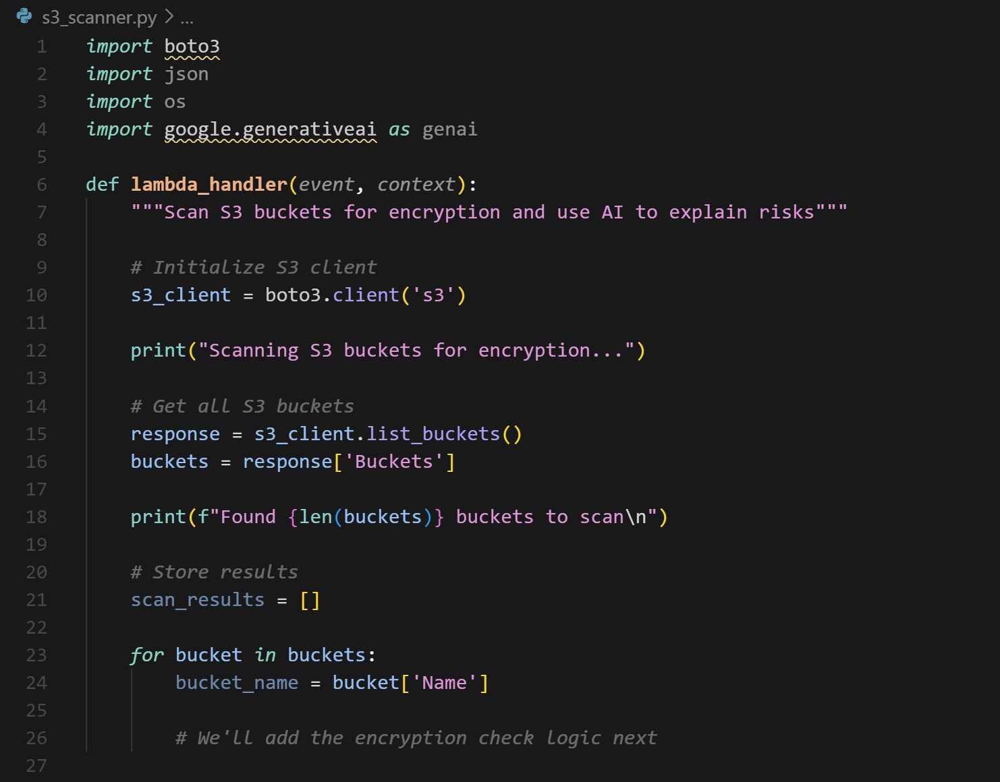
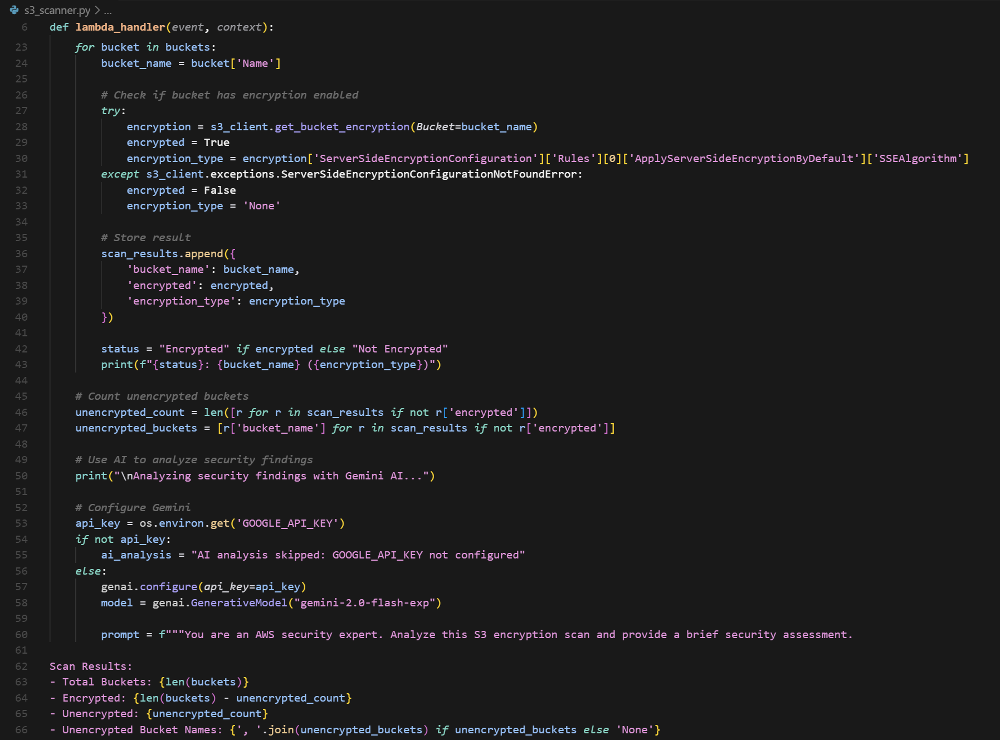
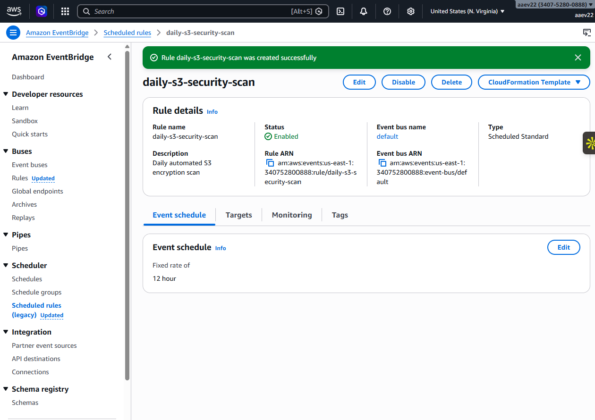

# AI-Powered S3 Security Scanner (AWS Lambda + EventBridge + Gemini)

This project implements a **serverless security scanner** that audits **Amazon S3 bucket encryption** across an AWS account. It runs as an **AWS Lambda** function (Python), can be triggered on a schedule via **Amazon EventBridge**, and optionally uses **Gemini** to provide a short, human-readable security assessment and recommendations.

---

## What this scanner checks

**Primary control:** whether each S3 bucket has **default server-side encryption** configured (SSE-S3 / SSE-KMS).  
The scanner:
- lists all buckets in the account,
- queries each bucket’s encryption configuration,
- summarizes which buckets are missing default encryption,
- (optional) sends a concise summary to Gemini for recommendations.

> Note: This scanner verifies **default encryption configuration** (bucket-level SSE settings). It does not validate object-level encryption on existing objects.

---

## Architecture



**Flow**
1. **EventBridge** triggers Lambda on a schedule (e.g., every 12 hours).
2. Lambda uses **boto3** to:
   - `ListBuckets`
   - `GetBucketEncryption`
3. Lambda logs results to **CloudWatch Logs**
4. (Optional) Lambda sends a scan summary to **Gemini** for security guidance.

---

## Technologies

- AWS Lambda (Python)
- Amazon S3
- Amazon EventBridge (scheduled rule)
- AWS IAM (least-privilege execution role)
- Amazon CloudWatch Logs
- Gemini via `google-generativeai`

---

## Deployment overview

### 1) Create a Gemini API key (optional)
Create an API key in Google AI Studio and store it as a Lambda environment variable.


Recommended environment variables:
- `GOOGLE_API_KEY` (optional)
- `GEMINI_MODEL` (optional, default: `gemini-2.0-flash-exp`)

---

### 2) Create a least-privilege IAM role for Lambda
Create an execution role (example name: `LambdaS3ScannerRole`) and attach permissions for:
- listing buckets,
- reading bucket encryption configuration,
- writing logs to CloudWatch.

Example IAM policy (tight baseline):
```json
{
  "Version": "2012-10-17",
  "Statement": [
    {
      "Sid": "ListBuckets",
      "Effect": "Allow",
      "Action": ["s3:ListAllMyBuckets"],
      "Resource": "*"
    },
    {
      "Sid": "GetBucketEncryption",
      "Effect": "Allow",
      "Action": ["s3:GetEncryptionConfiguration"],
      "Resource": "arn:aws:s3:::*"
    },
    {
      "Sid": "CloudWatchLogs",
      "Effect": "Allow",
      "Action": [
        "logs:CreateLogGroup",
        "logs:CreateLogStream",
        "logs:PutLogEvents"
      ],
      "Resource": "*"
    }
  ]
}
```


---

### 3) Deploy the Lambda function

**Included code:** `s3_scanner.py`

Handler:
- `s3_scanner.lambda_handler`

Runtime:
- Python 3.11 (recommended)

If you enable Gemini analysis, ensure the Lambda deployment package includes the `google-generativeai` dependency (via a Lambda Layer or vendored site-packages).

Code reference screenshots:





---

### 4) Schedule scans with EventBridge
Create a scheduled EventBridge rule (example name: `daily-s3-security-scan`) that targets your Lambda function.

In this build, the schedule is set to a fixed rate (example: **every 12 hours**).



---

## Testing & expected output

You can test via:
- Lambda console “Test” event (empty JSON is fine), or
- direct invocation via AWS CLI.

Expected behavior:
- CloudWatch Logs show bucket-by-bucket checks
- Return payload includes a scan summary and (if configured) Gemini analysis text

---

## Security & operational notes

- **Secrets:** never hardcode API keys. Use Lambda environment variables (or AWS Secrets Manager).
- **Least privilege:** keep IAM scoped to only what’s required.
- **Scale:** for accounts with many buckets, consider parallelization or pagination strategies.
- **Extensibility:** common next checks include:
  - public access blocks + bucket policies/ACLs
  - access logging enabled
  - versioning enabled
  - SSE-KMS enforcement + key policies
  - Security Hub / SNS notifications

---

## Folder contents

```
AI-AWS-S3-Security-Scanner/
├─ README.md
├─ s3_scanner.py
└─ screenshots/
   ├─ 00_architecture.png
   ├─ 01_gemini_api_key.png
   ├─ 02_s3_scanner_code_part1.png
   ├─ 03_s3_scanner_code_part2.png
   ├─ 04_iam_role_created.png
   ├─ 05_eventbridge_rule.png
   └─ 06_code_editor_context.png
```

---

## Project reference

This folder documents the build based on the “AI Security Scanner for AWS S3” project from NextWork:
- https://www.nextwork.org/projects/ai-aws-s3-security
