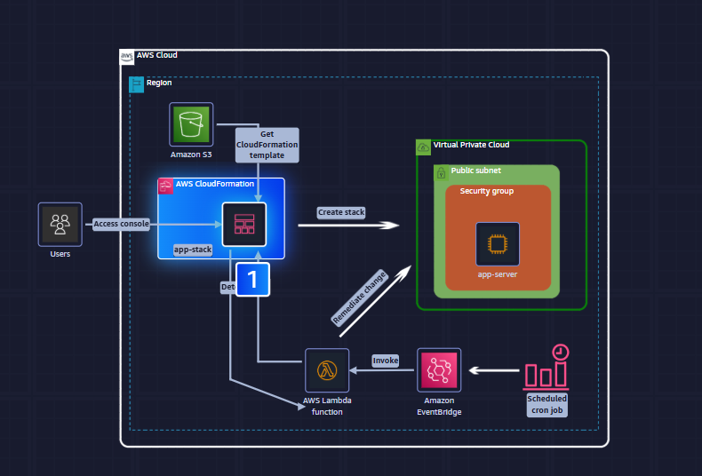
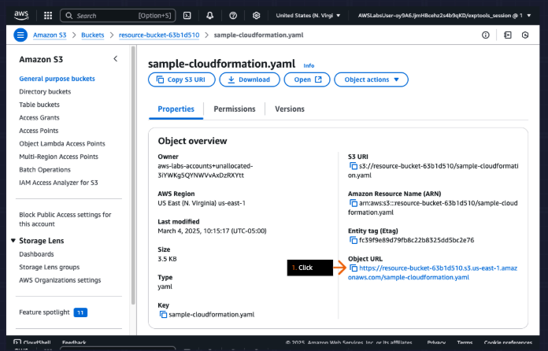
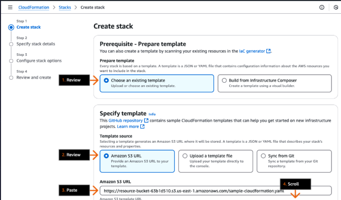
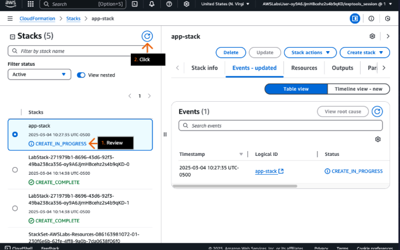
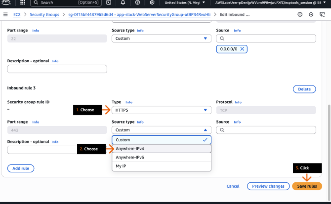
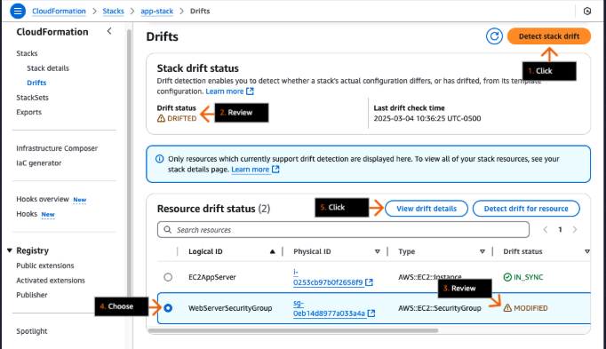
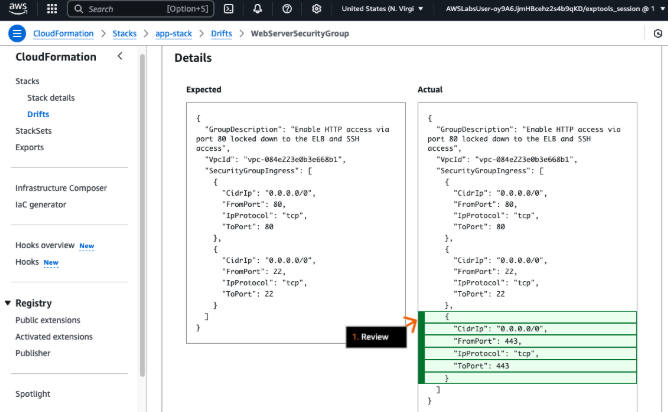

# AWS IaC Drift Detection (CloudFormation + EventBridge + Lambda)

## Summary
A startup needs rapid, compliant infrastructure delivery. This project implements automatic **drift detection and remediation** for an AWS CloudFormation-managed environment using **AWS Lambda** on an **Amazon EventBridge** schedule. When resources drift from the template, the Lambda function detects changes via CloudFormation’s drift APIs and **reverses unauthorized configuration changes** to restore compliance.


---

## Why this matters
Uncontrolled manual changes create hidden risk:
- **Compliance & audit gaps:** Resources deviate from the approved baseline (SOX/FedRAMP/NIST alignment suffers).
- **Operational fragility:** Manual edits break future updates/deletes via CloudFormation.
- **Security exposure:** Policy or network changes can bypass intended guardrails.

This project demonstrates **preventive & detective controls** and **automated corrective action**—a core security engineering pattern for cloud governance.

---

## Architecture
1. **CloudFormation Stack** deploys baseline resources from a **versioned template in S3**.  
2. **EventBridge Rule** triggers a **Lambda** function on a schedule (e.g., every 15 minutes).  
3. **Lambda**:
   - Calls `DetectStackDrift` / `DescribeStackDriftDetectionStatus`.
   - Enumerates drifted resources and **reconciles** them back to template state.
   - Emits **CloudWatch Logs** for auditability and metrics.
4. (Optional hardening) **IAM least-privilege** roles for Lambda and access to CloudFormation/S3.



---

## Implementation Steps
### Step 1 — Template source of truth in S3
- Store the CloudFormation template in an S3 bucket (versioned).  
- Deploy stack from the S3 URL to ensure traceability and rollbacks.



### Step 2 — Manage all changes via CloudFormation
- Use **Change Sets** (or direct updates) for any modification.  
- Direct edits to resources may block stack updates and introduce risk.

### Step 3 — Scheduled drift detection
- Create an **EventBridge rule** (cron/rate) that invokes the Lambda function.



### Step 4 — Lambda: detect drift
- Function calls `DetectStackDrift` and waits/polls until completion.  
- Retrieves drift details for remediation logic.



### Step 5 — Lambda: remediate drift
- For each drifted resource, compare actual vs. template state and revert.  
- Simple strategy: **re-apply** the template (stack update) or targeted API calls.  
- Log every action to **CloudWatch Logs** for auditing.



### Step 6 — Validate non-drifted state
- Re-run detection and confirm stack returns to **`DRIFT_STATUS: IN_SYNC`**.



---

## Automation Logic (High Level)
- **Trigger:** EventBridge schedule.
- **Detect:** `DetectStackDrift` → `DescribeStackResourceDrifts`.
- **Decide:** If drifted → determine remediation path (update stack or surgical fix).
- **Act:** Execute remediation; record results and metrics.
- **Verify:** Re-check drift status; alert if remediation fails.

---

## Security & Compliance Considerations
- **Least Privilege IAM:** Lambda role grants only CloudFormation, S3 (get template), and resource-specific permissions required for remediation.  
- **Change Control:** Enforce updates via CloudFormation; alert on direct changes.  
- **Auditability:** Persist logs/metrics; optionally ship to SIEM for **drift events** and **remediation outcomes**.  
- **Guardrails:** Pair with AWS Config / SCPs for preventive controls; use this solution for detective + corrective coverage.



---

## How to Reproduce

### Prerequisites
- AWS account with permissions to use S3, CloudFormation, EventBridge, Lambda, CloudWatch.
- S3 bucket (versioning recommended).
- (Optional) AWS SAM or CDK if you prefer to package/deploy Lambda as code.

### Deploy
1. **Upload Template to S3**  
   - `s3://<bucket>/templates/baseline.yaml`

2. **Create CloudFormation Stack**  
   - From S3 template URL (Parameters as needed).

3. **Create Lambda Function**  
   - Runtime: Python or Node.js.  
   - Env vars: `STACK_NAME`, `TEMPLATE_S3_URL`, `REMEDIATION_MODE` (e.g., `update-stack`).  
   - IAM role with least privilege.

4. **Create EventBridge Rule**  
   - Schedule: `rate(15 minutes)` (or as appropriate).  
   - Target: Lambda function.

5. **Test**  
   - Manually change a resource (e.g., security group rule or tag).  
   - Wait for schedule or invoke Lambda.  
   - Confirm remediation and **`IN_SYNC`** state.

---

## Ops & Troubleshooting
- **Concurrency / Long polls:** `DetectStackDrift` can take time; use backoff and idempotency keys.  
- **Stack in UPDATE_ROLLBACK_COMPLETE:** Clean up failed updates before drift cycles.  
- **Permissions:** If remediation fails, re-check the Lambda role’s specific actions for the resource types changed.  
- **Drift on deleted resources:** Handle resources in `DELETED`/`MODIFIED` states differently—some require full stack update.

---

## Metrics to Track (for resumes & interviews)
- **MTTD/MTTR for drift**, number of **drifts/month**, **% auto-remediated**, **false positives**, and **time saved** vs. manual checks.  
- Map outcomes to **NIST 800-53** families (e.g., **CM-2/CM-3/CM-6**, **AU-2/AU-6**) and **CIS AWS** controls where applicable.

---

## Repository Structure
```
.
├─ lambda/                  # Function code (detect + remediate)
├─ templates/               # CloudFormation templates (S3 source of truth)
├─ infra/                   # Optional: SAM/CDK/TF infra to bootstrap this solution
├─ Screenshots/             # Curated screenshots referenced below
└─ README.md
```

---

## Screenshots
- `01-architecture-overview.png` – End-to-end flow (S3 → CloudFormation → EventBridge → Lambda → CloudWatch).  
- `02-s3-template-and-stack.png` – Template in S3 + CloudFormation stack view.  
- `03-eventbridge-rule.png` – Scheduled rule targeting Lambda.  
- `04-lambda-config.png` – Lambda configuration pane (runtime/permissions).  
- `05-cloudwatch-remediation-logs.png` – Logs showing detection & remediation steps.  
- `06-drift-in-sync.png` – CloudFormation drift status back to **IN_SYNC**.  
- `07-iam-role-policy.png` – IAM role policy/permissions (least privilege).

---

## Future Enhancements
- **SNS/Email/Slack alerts** on drift detected/remediated.  
- **Selective remediation modes** (tag-based scoping, dry-run).  
- **SIEM integration** (Elastic/Chronicle/Splunk) for centralized monitoring.  
- **Change Set previews** prior to remediation for higher-risk resources.

---

## Author
Allie Evan — Cloud & Security Engineering Portfolio
