# AWS CloudFormation Drift Detection & Auto-Remediation

Automated infrastructure compliance enforcement using AWS-native services. An **EventBridge-scheduled Lambda function** continuously monitors a CloudFormation-managed stack for configuration drift — unauthorized changes made outside the IaC pipeline — and automatically restores the approved baseline when deviations are detected.

This project implements the **detective and corrective control** layer of a cloud governance model: infrastructure is defined once as code, and any deviation from that definition is detected, logged, and reversed without human intervention.

---

## Why Drift Matters

Infrastructure as Code works on the assumption that the deployed state matches the declared template. That assumption breaks the moment someone makes a direct change in the console, CLI, or API — a security group rule added manually, a tag removed, a bucket policy modified to troubleshoot an issue and never reverted.

The consequences compound:

- **Security exposure** — a manually opened security group rule or relaxed bucket policy may bypass intended network or access controls
- **Compliance gaps** — the approved baseline no longer reflects what is running; audit evidence becomes unreliable
- **Operational fragility** — CloudFormation's update and delete operations can fail or produce unexpected behavior when the actual resource state diverges from what the template expects

Drift detection closes this loop: the template remains the authoritative source of truth, and the system enforces it continuously.

---

## Architecture

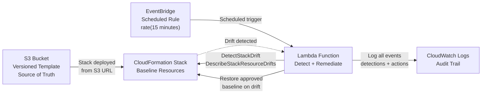
```mermaid
flowchart LR
    S3["S3 Bucket\nVersioned Template\nSource of Truth"]
    CF["CloudFormation Stack\nBaseline Resources"]
    EB["EventBridge\nScheduled Rule\nrate(15 minutes)"]
    Lambda["Lambda Function\nDetect + Remediate"]
    CW["CloudWatch Logs\nAudit Trail"]

    S3 -->|"Stack deployed\nfrom S3 URL"| CF
    EB -->|"Scheduled trigger"| Lambda
    Lambda -->|"DetectStackDrift\nDescribeStackResourceDrifts"| CF
    Lambda -->|"Restore approved\nbaseline on drift"| CF
    Lambda -->|"Log all events\ndetections + actions"| CW
    CF -. "Drift detected" .-> Lambda
```

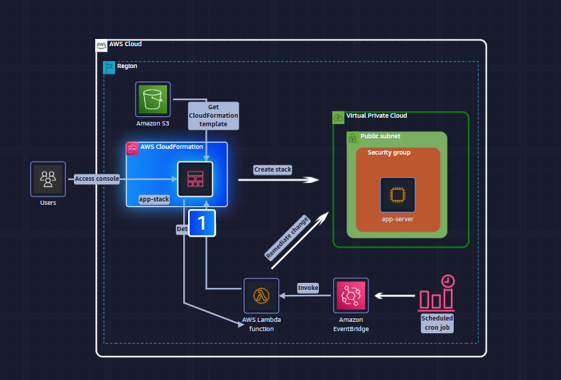

**Control flow:**
1. All infrastructure is defined in a versioned CloudFormation template stored in S3
2. EventBridge fires the Lambda function on a fixed schedule
3. Lambda calls `DetectStackDrift` and polls until the detection cycle completes
4. If drifted resources are found, Lambda reconciles them back to template state
5. Every detection cycle — drift or clean — is written to CloudWatch Logs for audit continuity

---

## Implementation

### Template as Source of Truth in S3

The CloudFormation template lives in a versioned S3 bucket. The stack is deployed from the S3 URL rather than a local file, which provides traceability (every deployment references a specific object version) and enables rollback by redeploying from an earlier version.

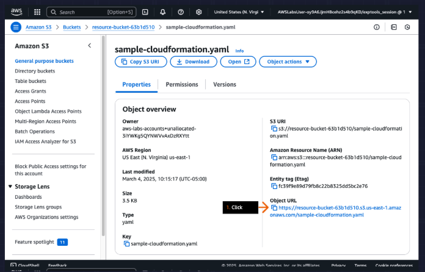

Any change to the infrastructure must go through a template update and CloudFormation change set — direct resource edits are the failure mode this project is designed to detect.

### EventBridge Scheduled Rule

An EventBridge rule fires on a `rate(15 minutes)` schedule, targeting the Lambda function. The schedule interval is configurable; tighter intervals reduce the window between a drift event and its detection, at the cost of additional Lambda invocations.

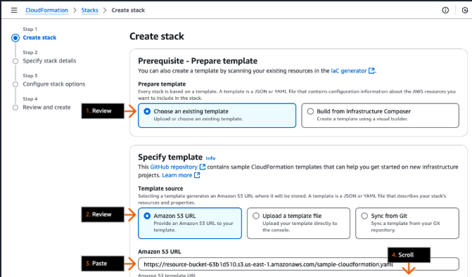

### Lambda — Drift Detection

The Lambda function calls `DetectStackDrift` to initiate a drift assessment on the target stack, then polls `DescribeStackDriftDetectionStatus` until the assessment completes. Once finished, `DescribeStackResourceDrifts` returns the per-resource drift status with a diff of actual vs. expected property values.

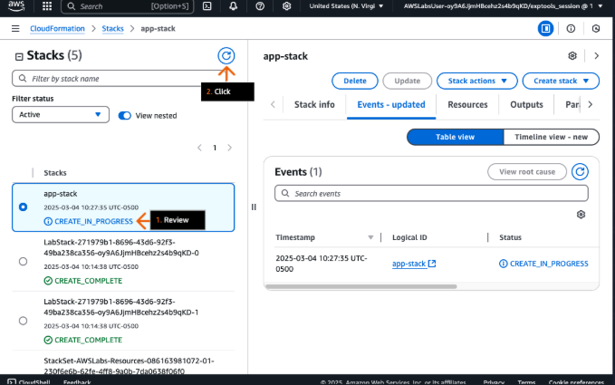

### Lambda — Remediation

For each drifted resource, the function determines the remediation path and restores the approved state. Every action is logged to CloudWatch with the resource ID, drift type, and remediation outcome — producing a timestamped audit trail of all detected deviations and the response taken.

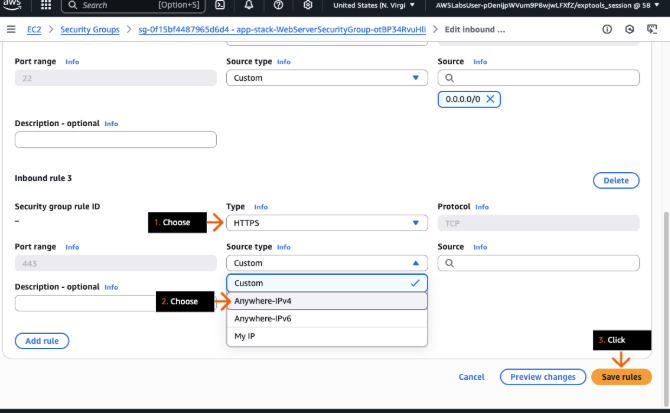

### Validation

After remediation, drift detection is re-run to confirm the stack returns to `DRIFT_STATUS: IN_SYNC`. This closes the remediation loop and provides evidence that the corrective action was effective.

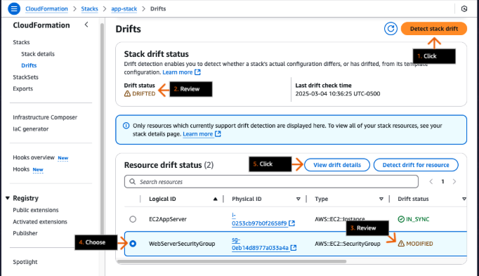

### IAM — Least Privilege

The Lambda execution role grants only the specific permissions required: CloudFormation drift detection APIs, S3 read access for the template bucket, and the resource-specific permissions needed for remediation. No broad `*` actions, no unused services.

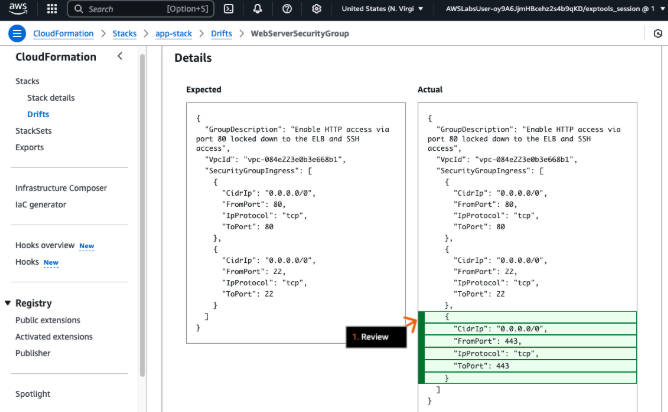

---

## Security & Compliance Context

### NIST 800-53 Control Mapping

| Control Family | Control | How This Project Addresses It |
|---|---|---|
| Configuration Management | **CM-2** (Baseline Configuration) | CloudFormation template in S3 is the documented, version-controlled baseline |
| Configuration Management | **CM-3** (Configuration Change Control) | All changes route through CloudFormation; direct changes are detected and reversed |
| Configuration Management | **CM-6** (Configuration Settings) | Drift detection enforces that deployed settings match approved configuration |
| Audit & Accountability | **AU-2** (Event Logging) | CloudWatch logs every detection cycle, drift event, and remediation action |
| Audit & Accountability | **AU-6** (Audit Review) | Logs are structured for review and can be forwarded to a SIEM |

### Defense Model

This solution implements three of the four control types defined in most compliance frameworks:

- **Preventive** — enforcing that changes go through CloudFormation (change control process)
- **Detective** — scheduled drift detection identifies unauthorized changes
- **Corrective** — automated remediation restores the approved baseline

The remaining type — **deterrent** — can be added via alerting and visibility: knowing that changes will be detected and reversed discourages ad hoc modifications.

---

## Additional Screenshots

<details>
<summary>View additional lab screenshots</summary>

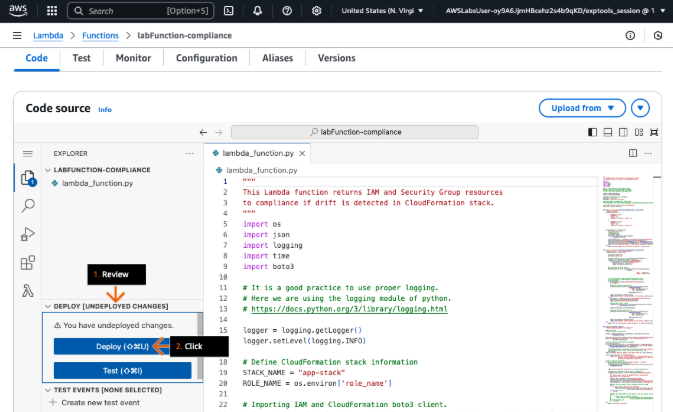
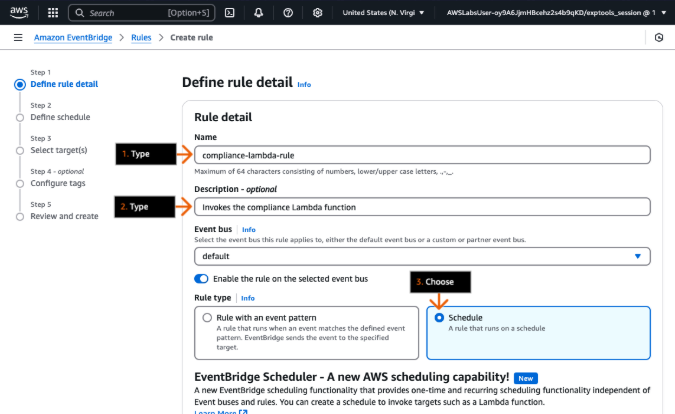
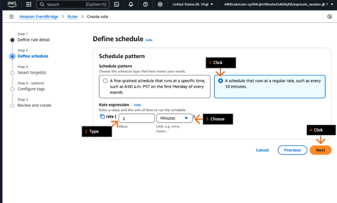
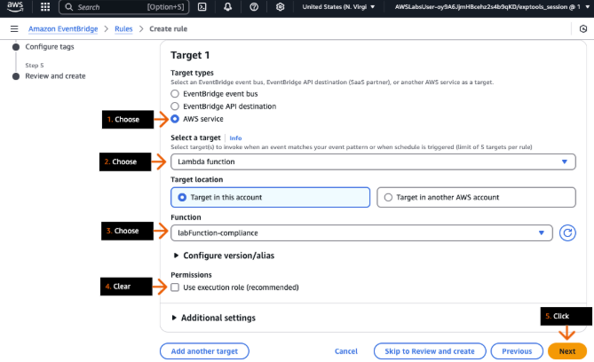
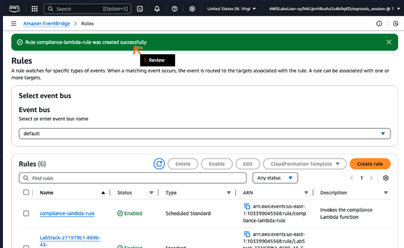
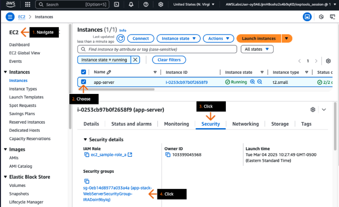
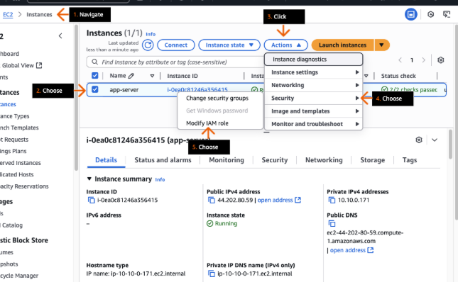

</details>

---

## Reproducing This Lab

### Prerequisites

- AWS account with permissions for S3, CloudFormation, EventBridge, Lambda, CloudWatch, and IAM
- S3 bucket with versioning enabled
- Python 3.x runtime for Lambda (or Node.js — either works)

### Steps

**1. Store the template in S3**
```
s3://<your-bucket>/templates/baseline.yaml
```
Enable versioning on the bucket before uploading.

**2. Deploy the CloudFormation stack**

Create the stack from the S3 template URL. Note the stack name — the Lambda function references it via environment variable.

**3. Create the Lambda function**

- Runtime: Python 3.x
- Environment variables: `STACK_NAME`, `TEMPLATE_S3_URL`, `REMEDIATION_MODE`
- Attach the least-privilege IAM role (CloudFormation + S3 + resource-specific permissions)
- Timeout: increase beyond the default 3 seconds — drift detection polling can take 30–60+ seconds on larger stacks

**4. Create the EventBridge rule**

- Schedule: `rate(15 minutes)` (adjust as needed)
- Target: the Lambda function created above
- Ensure EventBridge has permission to invoke Lambda (`lambda:InvokeFunction`)

**5. Test**

Manually change a deployed resource — modify a security group rule, alter a tag, or change a bucket policy. Wait for the next Lambda invocation (or invoke manually), then confirm:
- CloudWatch Logs show the drifted resource and remediation action
- CloudFormation drift status returns to `IN_SYNC`

---

## Operational Notes

- **Detection latency:** `DetectStackDrift` is an asynchronous API; allow for polling time. Build in exponential backoff to avoid throttling on large stacks.
- **Stack update conflicts:** If the stack is in `UPDATE_IN_PROGRESS` or `UPDATE_ROLLBACK_COMPLETE`, drift detection cannot run — handle these states explicitly in the Lambda logic.
- **Deleted resources:** Resources in `DELETED` state require a full stack update rather than a targeted API fix — treat separately.
- **Remediation scope:** Not all resource types support targeted rollback via API. For those, a full stack re-sync from the S3 template is the reliable path.

---

## Future Enhancements

- **SNS/Slack alerting** on drift detection events, separate from remediation logs
- **Dry-run mode** — log what would be remediated without taking action, for change review workflows
- **Tag-based scoping** — limit detection to stacks or resources tagged for active enforcement
- **SIEM forwarding** — ship CloudWatch drift events to Elastic or Splunk for centralized visibility

---

## Repository Structure

```
.
├── lambda/          # Detection and remediation function code
├── templates/       # CloudFormation baseline templates (S3 source of truth)
├── Screenshots/     # Lab screenshots referenced above
└── README.md
```

---

Allie Evan · [linkedin.com/in/allie-evan](https://linkedin.com/in/allie-evan) · [github.com/alevan22](https://github.com/alevan22)
