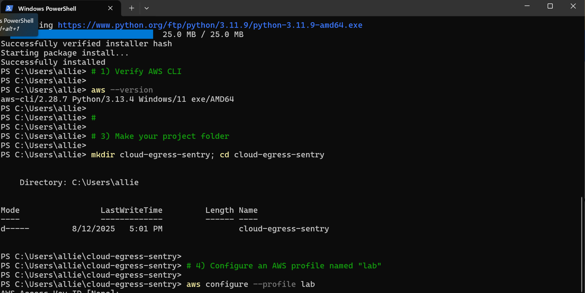

# GitLab CI/CD Pipeline for a Python Web App (Test → Build → Push → Deploy to **AWS EC2**)

A production‑style CI/CD lab that demonstrates how I design secure pipelines: unit tests, container build, registry push to a private repo, and an automated deploy to an Ubuntu‑based **EC2** instance over SSH. Built on GitLab’s managed runners and Docker‑in‑Docker.


## Outcome

* **Automated pipeline**: `test → build → deploy`, enforced with GitLab stages.
* **Containerized delivery**: Build and push a versioned image to **Docker Hub (private)**.
* **One‑click deploy**: SSH into **AWS EC2 (Ubuntu)** and run the container on port **5000**.
* **Secret hygiene**: Creds stored as **masked CI variables**; SSH private key stored as a **file variable** with restricted permissions.

---

## Architecture


---

## Repository Structure

```
.
├── .devcontainer/ .github/ .vscode/   # developer tooling
├── deploy/                            # (optional) infra or scripts
├── src/                               # application source
│   └── app/                           # Flask app
│       └── tests/                     # pytest tests executed in CI (path may be src/app/tests)
├── tests/                             # (legacy) tests folder in template repos
├── Dockerfile                         # builds Python web app (exposes 5000)
├── .gitlab-ci.yml                     # pipeline config
├── makefile                           # includes `make test`, `make run`
└── README.md
.
├── app/                 # demo app source
│   └── tests/           # pytest tests executed in CI
├── Dockerfile           # builds Python web app (exposes 5000)
├── Makefile             # includes `make test`, `make run`
└── .gitlab-ci.yml       # pipeline config

````

---

## Prerequisites
- **GitLab project** with shared runners enabled
- **Docker Hub** account and **private repository**
- **AWS EC2** Ubuntu 22.04+ instance with:
  - Inbound **TCP 22** (SSH) and **TCP 5000** (app) allowed in the security group
  - Public IPv4 or DNS reachable from the internet
  - An **SSH key pair**; keep the **private** key on your workstation
- Local tools (optional for dev): Python 3.9+, pip, make, Docker

### Prepare the EC2 host (once)
```bash
# Connect (replace values accordingly)
ssh -i ~/.ssh/ec2_key.pem ubuntu@<EC2_PUBLIC_IP>

# Install and enable Docker (Ubuntu)
sudo apt update && sudo apt install -y docker.io
sudo systemctl enable --now docker

# (Optional) Allow non-root docker usage after next login
sudo usermod -aG docker ubuntu
````



> Ensure your EC2 security group allows inbound **5000/tcp** if you want to access the app from a browser.


---

## CI/CD Variables (GitLab → Settings → CI/CD → Variables)

Create the following variables. Mark sensitive values **Masked** and **Protected** as appropriate.

| Key             | Type     | Example / Notes                                                           |
| --------------- | -------- | ------------------------------------------------------------------------- |
| `REGISTRY_USER` | Var      | Docker Hub username                                                       |
| `REGISTRY_PASS` | Var      | Docker Hub PAT/password                                                   |
| `SSH_KEY`       | **File** | Paste the **private key** contents; GitLab will mount a temp file in jobs |
| `SERVER_HOST`   | Var      | EC2 Public IP or DNS (e.g., `3.91.24.10`)                                 |
| `SSH_USER`      | Var      | `ubuntu` (default for Ubuntu AMIs)                                        |
| `SSH_PORT`      | Var      | `22`                                                                      |

> File variables are exposed as paths inside jobs. This pipeline tightens file permissions before use.

---

## Local Development (optional)

```bash
make test                 # installs deps via pip, runs pytest
PORT=5004 make run        # http://localhost:5004
```


---

## `.gitlab-ci.yml`

Uses Python for tests, Docker‑in‑Docker for build/push, then an SSH‑driven deploy to EC2. Image tags default to the commit SHA for traceability.

```yaml
variables:
  IMAGE_NAME: "$REGISTRY_USER/python-app"
  IMAGE_TAG:  "$CI_COMMIT_SHORT_SHA"

stages: [test, build, deploy]

run_tests:
  stage: test
  image: python:3.9-slim
  before_script:
    - apt-get update && apt-get install -y make
  script:
    - make test

build_image:
  stage: build
  image: docker:27
  services:
    - docker:27-dind
  variables:
    DOCKER_TLS_CERTDIR: "/certs"   # share certs between docker client and daemon
  script:
    - echo "$REGISTRY_PASS" | docker login -u "$REGISTRY_USER" --password-stdin
    - docker build -t "$IMAGE_NAME:$IMAGE_TAG" .
    - docker push "$IMAGE_NAME:$IMAGE_TAG"

deploy_to_ec2:
  stage: deploy
  # default GitLab image is sufficient for ssh; alpine:latest also works
  before_script:
    - chmod 400 "$SSH_KEY"   # restrict private key file perms
  script:
    - >
      ssh -i "$SSH_KEY" -o StrictHostKeyChecking=no -p "$SSH_PORT" "$SSH_USER"@"$SERVER_HOST" \
      "echo '$REGISTRY_PASS' | sudo docker login -u '$REGISTRY_USER' --password-stdin && \
       ids=\"$(sudo docker ps -aq)\"; if [ -n \"$ids\" ]; then sudo docker stop $ids; sudo docker rm $ids; fi && \
       sudo docker run -d -p 5000:5000 '$IMAGE_NAME:$IMAGE_TAG'"
```

**Why this design**

* **Stages** enforce order and act as quality gates.
* **Docker‑in‑Docker** isolates the build and avoids host coupling.
* **Short‑SHA tags** provide traceability across code, image, and deploy.
* **SSH + docker run** keeps the deploy primitive and easy to audit.

---

**Pipeline evidence**


When finished, remove the instance or lock down the security group.

---


