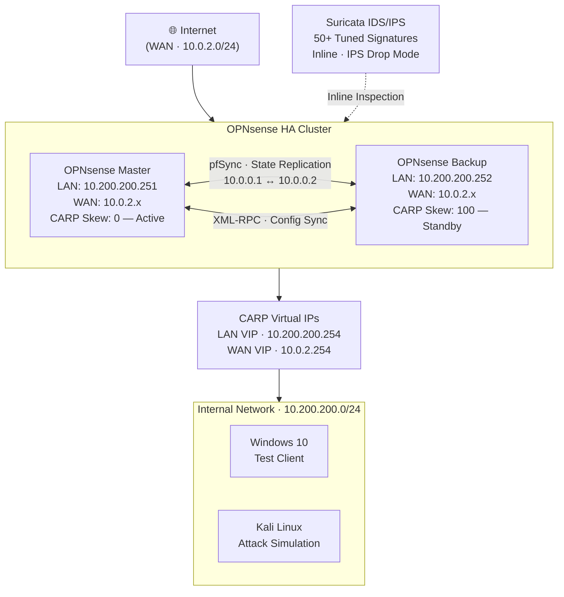

# High Availability Firewall Cluster with OPNsense & Suricata IDS/IPS

A virtualized network security lab building a **production-grade high availability (HA) firewall cluster** using two OPNsense instances in active/standby configuration, with an **inline Suricata IDS/IPS** deployment layered on top for real-time threat detection and blocking.

The lab replicates the core architecture used in enterprise and government network environments: redundant perimeter enforcement, stateful failover, and signature-based intrusion prevention — all validated through live failover testing and controlled attack simulation.

---

## Architecture

### Network Segments

| Network | Subnet | Purpose |
|---|---|---|
| WAN | 10.0.2.0/24 | Simulated external internet (VirtualBox NAT) |
| LAN | 10.200.200.0/24 | Internal client segment |
| pfSync | 10.0.0.0/24 | Dedicated firewall-to-firewall state replication |

### CARP Virtual IPs

| VIP | Interface | VHID | Purpose |
|---|---|---|---|
| 10.200.200.254 | LAN | 1 | Default gateway for all internal clients |
| 10.0.2.254 | WAN | 2 | Outbound NAT translation address |

The master holds CARP priority via skew 0. If the master becomes unavailable, the backup promotes to master and assumes both VIPs within seconds — transparent to LAN clients.

---

## High Availability Mechanics

### CARP — Common Address Redundancy Protocol

Both nodes share a set of virtual IP addresses. The active master continuously broadcasts CARP advertisements; the standby monitors them. On master failure, the standby detects the absence of advertisements and promotes itself, assuming ownership of the VIPs. LAN clients routing to `10.200.200.254` experience no configuration change.

### pfSync — Connection State Replication

Active TCP/UDP session state tables are replicated from master to backup in real time over the dedicated pfSync interface. When failover occurs, the backup already holds a copy of all active connections — established sessions are not dropped.

### XML-RPC — Configuration Synchronization

The master pushes its complete configuration to the backup on every change: firewall rules, NAT rules, DHCP leases, and user/group definitions. Both nodes remain policy-identical at all times, eliminating configuration drift between cluster members.

---

## Firewall Rules & Network Policy

30+ rules were implemented across WAN, LAN, and pfSync interfaces:

- **Default-deny WAN inbound** — all unsolicited inbound traffic dropped; explicit permit rules required for any allowed service
- **LAN egress controls** — source-based rules governing which internal hosts can reach which external destinations and on which protocols
- **WAF-style HTTP/HTTPS filters** — application-layer rules inspecting HTTP methods, URI patterns, and header values to block common web attack patterns at the firewall before traffic reaches internal hosts
- **ICMP policy** — selective ICMP rules supporting CARP health checking and controlled diagnostic traffic while blocking unsolicited external pings
- **pfSync network isolation** — firewall rules explicitly restricting the pfSync interface to state replication traffic only, preventing it from being used as a lateral movement path

**Outbound NAT** uses Hybrid mode with the WAN CARP VIP (`10.0.2.254`) as the translation address, ensuring external traffic always originates from the same IP regardless of which node is currently active.

---

## Suricata IDS/IPS

Suricata was deployed inline on OPNsense in **IPS (drop) mode** — detected traffic matching block-category signatures is dropped at the network layer, not merely logged. This is the operational difference between a monitoring tool and an active enforcement layer.

### Rule Tuning

Rather than bulk-enabling a ruleset, signatures were individually reviewed:

- **50+ signatures enabled** across categories: port scanning, protocol anomalies, malware C2 indicators, and exploit patterns
- Signatures with high false-positive rates in lab environments were suppressed or had thresholds adjusted using Suricata's `suppress` and `threshold` directives
- The goal was actionable, low-noise alerting — a bulk-enabled default ruleset generates hundreds of alerts per minute in a test environment, making genuine detections difficult to identify

### Detection Validation — Nmap

Detection coverage was validated with a controlled **Nmap scan** launched from the Kali Linux VM:

- Suricata generated alerts for multiple scan types including SYN scan, service version detection (`-sV`), and OS fingerprinting (`-O`)
- Alerts were reviewed in the OPNsense Suricata alert log and confirmed to correspond 1:1 with observed scan activity
- Tuned signatures correctly identified scan behavior without triggering false positives on normal LAN traffic running concurrently

This validates that the tuning process preserved detection capability while reducing noise — the core challenge in production IDS/IPS operations.

---

## Failover Validation

Failover was tested by simulating hard master failure (disconnecting LAN and WAN adapters):

1. Continuous ping running to CARP VIP `10.200.200.254` from Windows 10 client
2. Master adapters disconnected — backup detected missing CARP advertisements and promoted to master
3. VIP remained responsive; observed minimal packet loss (1–2 packets) during promotion
4. CARP status widget on backup confirmed role change to **MASTER**
5. pfSync state replication confirmed effective — no established connections dropped
6. Original master reconnected — negotiated back to master role gracefully via CARP priority

---

## Lab Environment

| Component | Details |
|---|---|
| Hypervisor | VirtualBox |
| Firewall OS | OPNsense (two instances) |
| IDS/IPS Engine | Suricata (inline, IPS drop mode) |
| Test Clients | Windows 10, Kali Linux |
| Network Mode | Internal networks + VirtualBox NAT |

---

## Security Engineering Context

This lab demonstrates several capabilities that directly apply to enterprise and government network security:

**High Availability as a Security Requirement**
Firewall availability is not just an uptime concern — it is a security control. A failed firewall that fails open exposes the network; one that fails closed creates an outage. CARP + pfSync delivers the correct failure mode: seamless handoff with no traffic interruption and no policy gap. This maps to NIST 800-53 **SC-5** (Denial of Service Protection) and **CP-10** (System Recovery and Reconstitution) control families.

**Inline IPS vs. Passive IDS**
Passive IDS generates alerts that require human triage. Inline IPS acts immediately. For environments where alert fatigue is a real operational risk, tuned inline blocking provides a more effective defensive posture — at the cost of requiring careful rule validation to avoid blocking legitimate traffic. The tuning process here reflects that trade-off.

**Defense in Depth at the Perimeter**
Layering a stateful firewall (policy enforcement), CARP (availability), and Suricata (threat detection) at the same perimeter node creates multiple independent controls. An attacker who evades the firewall rules still faces signature detection; a node failure does not expose the network. This is the layered defense model referenced in CIS Control 13 (Network Monitoring and Defense).

---

Allie Evan · [linkedin.com/in/allie-evan](https://linkedin.com/in/allie-evan) · [github.com/alevan22](https://github.com/alevan22)
