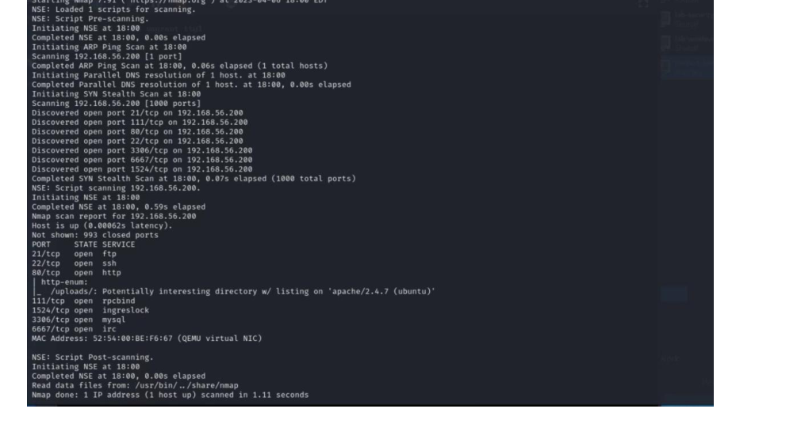
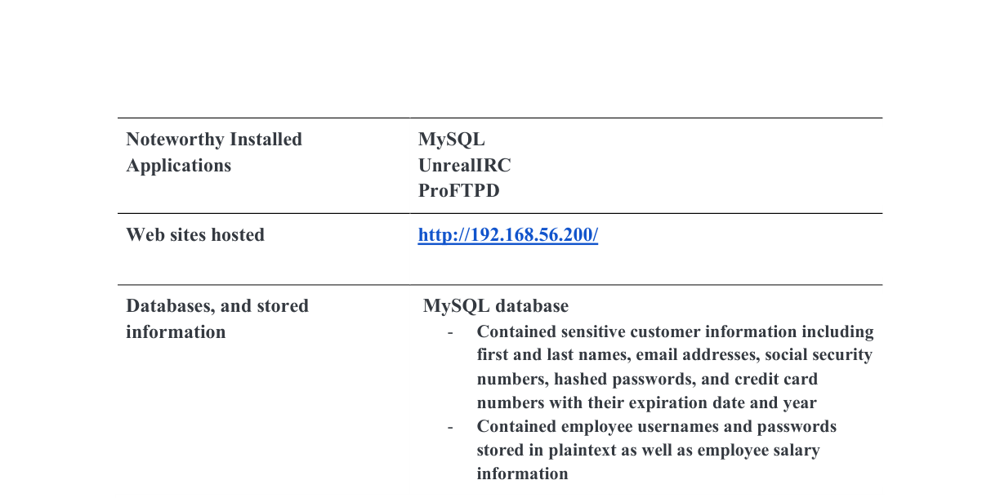
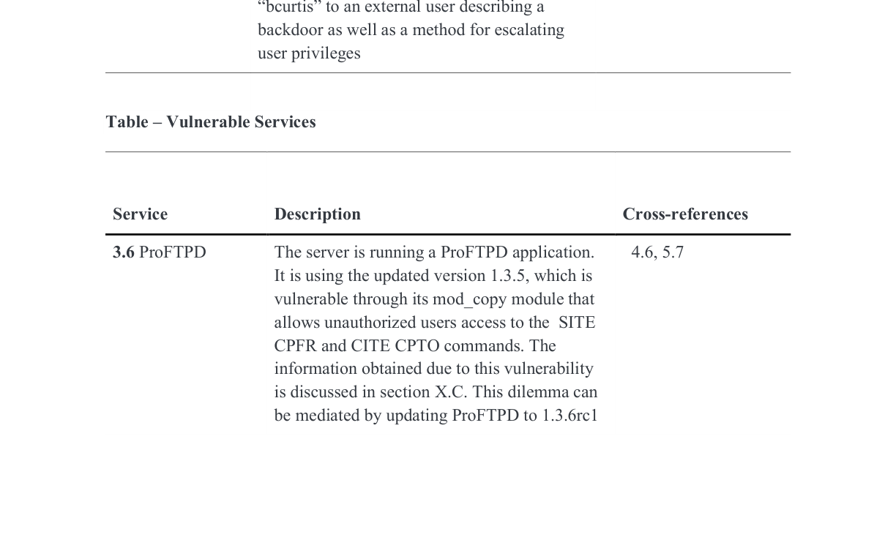
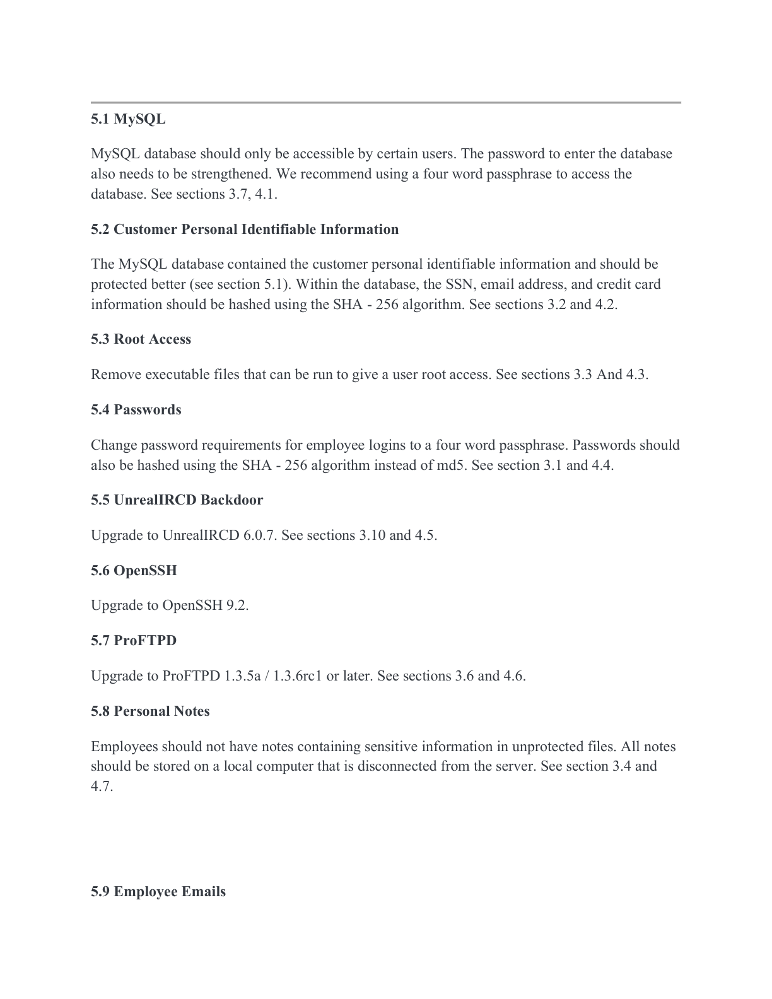

# Humbleify Penetration Test (Authorized Lab Assessment)

> **Ethics / Authorization:** This work was performed against an *authorized, single-host* lab environment (“Humbleify” vagrantbox VM) as part of a scoped penetration test. Do **not** reuse techniques against systems you do not own or explicitly have permission to test.

---

## 1) Engagement Summary

**Engagement type:** Black-box (initially provided only the target IP)  
**Scope:** Single Humbleify asset (vagrantbox VM)  
**Duration:** 3 weeks

### Key outcomes (measured)

| Metric | Result |
|---|---:|
| Engagement duration | 3 weeks |
| In-scope assets | 1 host |
| Exposed network services identified | 7 |
| Employees affected | 7 |
| Customer records exposed | 430,000 |
| Employee accounts compromised | 5 |
| Privilege level achieved | root |

- **Passwords cracked in minutes** due to weak policy and hashing/storage weaknesses.
- An **encrypted message referenced a “backdoor”** into the environment, increasing insider-risk concerns.

---

## 2) Target Environment & Attack Surface

### Host profile
- **OS:** Ubuntu 14.04 (Linux kernel 3.13)
- **Primary web app:** `http://192.168.56.200/` (lab)

### Exposed services observed (7 services)
| Service | Notes / Version (as observed) | Primary Risk |
|---|---|---|
| FTP | ProFTPD 1.3.5 | mod_copy exposure enables unauthorized file copy / data leakage |
| SSH | OpenSSH 6.6.1p1 | Credential-based access (sensitive to weak passwords) |
| HTTP | Apache 2.4.7 | Misconfiguration enables WebDAV upload path |
| RPC | rpcbind (2–4) | Expands attack surface (service discovery / legacy exposure) |
| Backdoor service | ingreslock (port 1524) | Passwordless login backdoor behavior |
| Database | MySQL (remote accessible) | PII exposure; weak crypto/storage |
| IRC | UnrealIRCd 3.2.8.1 | Known backdoor → remote code execution risk |

### Evidence (sanitized)


---

## 3) Exploitation Chain (High-Level)

The most reliable compromise path combined **service misconfigurations**, **credential weaknesses**, and **privilege escalation**:


---

## 4) Findings Overview

### A) High-impact data exposure
- **Customer PII** stored in MySQL included **names, email addresses, SSNs, credit card data, and password hashes**.
- **Employee usernames/passwords** were present in the database, including **plaintext passwords** and **salary information**.



### B) Credential compromise
- Employee password policy was weak enough to enable rapid compromise.
- Additional hashes were obtained through server-side artifacts and cracked offline.

### C) Backdoors / remote access vectors
- **ingreslock** facilitated **passwordless access** behavior on port 1524.
- **UnrealIRCd 3.2.8.1** presented a backdoor exploit path that could yield code execution as an OS user.

### D) Privilege escalation to root
- **Sudo misconfiguration** (privileged user) enabled an immediate root shell once credentials were obtained.
- A **root-granting executable artifact** (`documents.zip`) was runnable by any user, enabling escalation without privileged group membership.

---

## 5) Vulnerability Details (Technical)

> Note: This section is intentionally written to be **defensive and technical** while avoiding step-by-step exploit instructions.

### 5.1 ProFTPD mod_copy exposure (unauthenticated file copy)
**Impact:** Unauthorized reading of sensitive files + user enumeration → accelerates credential attacks and lateral movement.  
**Root cause:** ProFTPD 1.3.5 with mod_copy enabled (SITE CPFR/CPTO).  
**Recommended remediation:**
- Upgrade ProFTPD to a patched version (≥ 1.3.5a / 1.3.6rc1 per report)
- Disable `mod_copy` if not required
- Restrict FTP exposure to trusted networks; prefer SFTP-only



### 5.2 WebDAV enabled on `/uploads/`
**Impact:** Remote upload capability can enable web-based execution paths if dangerous file types are allowed.  
**Recommended remediation:**
- Disable WebDAV if not required
- If required, enforce strict allow-lists (block `.php` and executable content), authN/authZ, and separate upload storage from web root

### 5.3 Ingreslock backdoor behavior (port 1524)
**Impact:** Passwordless login vector → direct unauthorized access.  
**Recommended remediation:**
- Remove the ingreslock service entirely
- Block/close port 1524 at the host firewall level (defense-in-depth)

### 5.4 UnrealIRCd backdoor (3.2.8.1)
**Impact:** High-risk backdoor path to code execution.  
**Recommended remediation:**
- Upgrade UnrealIRCd to 6.0.7 or decommission the service if unnecessary
- Restrict to internal networks only; require strong authentication and monitoring


### 5.5 MySQL exposure + weak protection of sensitive data
**Impact:** Direct access to PII and employee credentials.  
**Recommended remediation:**
- Restrict MySQL to localhost / private networks; enforce least-privilege DB accounts
- Use strong secrets management (no password hints in files)
- Hash sensitive fields appropriately (e.g., SHA-256 for non-reversible needs); tokenize/encrypt where retrieval is required

---

## 6) Prioritized Remediation Plan

**Top priorities (high ROI / high risk reduction):**
1. **Eliminate backdoor services** (ingreslock, UnrealIRCd) or hard-isolate them
2. **Fix privilege escalation paths** (remove root-granting executables; tighten sudo policy)
3. **Restrict database access** + implement strong protection for sensitive fields
4. **Disable/lock down WebDAV** and restrict upload types
5. **Enforce strong password policy** and modern hashing practices



---

## 7) Detection Engineering Notes (Blue-Team Additions)

**Recommended telemetry**
- SSH auth logs (`/var/log/auth.log`), failed login rate anomalies, geofencing
- FTP logs: unexpected use of file-copy commands; anomalous access patterns
- Web server logs: WebDAV `PUT`/`PROPFIND` spikes; uploads of executable content
- DB logs: remote connections; schema access patterns; bulk reads
- Host auditing: execution of SUID / suspicious binaries; privilege escalation attempts

**Example alert ideas**
- WebDAV writes of executable extensions into upload paths
- Sudden increase in failed SSH auth across multiple accounts
- Any inbound connection attempts to TCP/1524
- UnrealIRCd process/network activity outside expected maintenance windows

---

## 8) Repository Structure


# Humbleify Penetration Test

## Overview
This repository documents a team-based penetration test conducted on a duplicate Humbleify server in April 2024. The objective was to simulate an internal attacker scenario on an outdated production-like Ubuntu 14.04 host to uncover high-impact vulnerabilities.

---

## Objectives
✅ Enumerate active services and identify exposed attack surface.  
✅ Exploit misconfigurations and weak authentication controls.  
✅ Escalate privileges to root and demonstrate data breach potential.  
✅ Recommend prioritized remediation steps.

---

## Methodology

### 1️⃣ Reconnaissance & Enumeration
- `nmap -sS -sV -T4 <target>` identified:
  - SSH (22), ProFTPD (21), UnrealIRCD (6667), Apache/WebDAV (80), MySQL (3306).
- `enum4linux` & banner grabbing revealed OS & service versions.
- MySQL with no encryption or access control.

### 2️⃣ Initial Access
- Brute-force employee accounts through hydra:
  ```
  Validated 7 accounts with weak passwords.

### 3️⃣ Exploitation
- Metasploit modules for ProFTPD and UnrealIRCD to gain shell access.
- `davtest` used on misconfigured WebDAV to upload a PHP webshell.

### 4️⃣ Data Exfiltration
- `mysqldump` retrieved PII of ~430,000 customers in plaintext:
  ```bash
  mysqldump -u root -p customerdb > dump.sql
  ```

### 5️⃣ Privilege Escalation
- Identified insecure `sudo` permissions:
 
  ```
  Escalated to root via misconfigured cron job.

---

## Key Findings
🚨 Weak employee passwords (common/guessable; MD5 hashing).  
🚨 Legacy backdoor on UnrealIRCD still active.  
🚨 Sensitive PII unencrypted in MySQL database.  
🚨 Insecure `sudo` rules enabling root privilege escalation.

---

## Tools & Techniques
- Recon: Nmap, Enum4linux
- Brute-forcing: Hydra, Hashcat
- Exploitation: Metasploit, davtest
- Privilege escalation: GTFOBins techniques, cron job abuse
- Data exfiltration: mysqldump
- Validation: Wireshark

---

## Full Report


