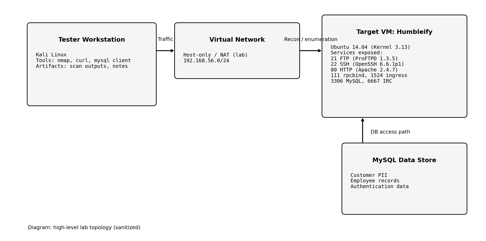
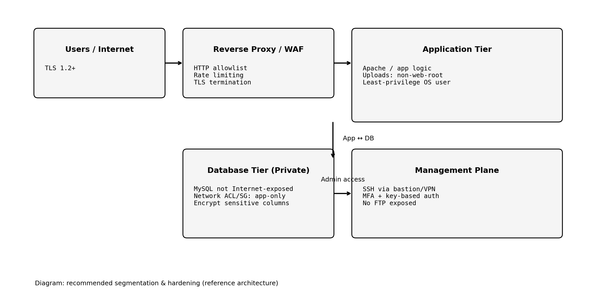
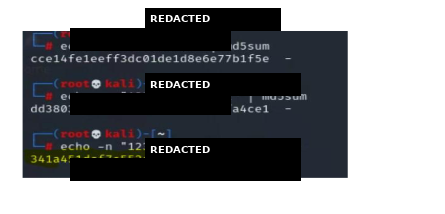
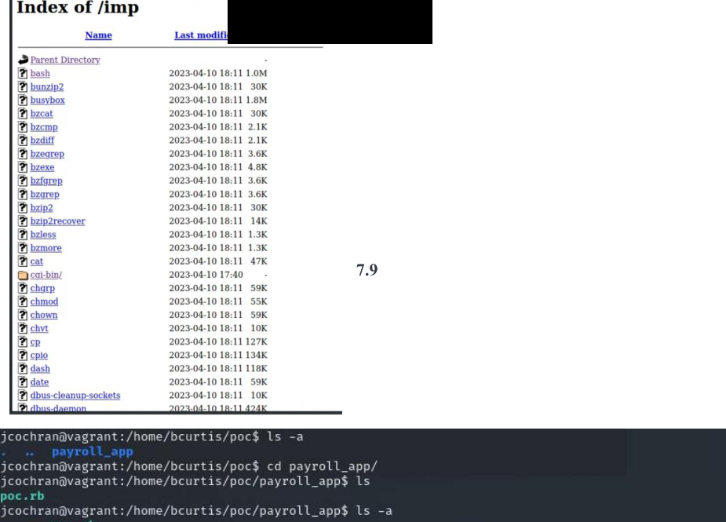

# Humbleify Penetration Test — Technical Portfolio Write‑Up (Sanitized)

> **Purpose:** A professional, shareable write‑up of an authorized penetration test against a lab/duplicate Humbleify server.
>
> **Sanitization:** Credentials, secrets, PII, host‑unique identifiers, exploit payloads/strings, and step‑by‑step intrusion instructions have been removed.

---

## Network architecture

### As‑is lab topology (sanitized)



### Recommended reference architecture (segmentation + hardening)



---

## Engagement overview

**Type:** Black‑box penetration test (initial input: target IP only)  
**Environment:** Authorized duplicate of the Humbleify server (lab VM)  
**Duration:** 3 weeks  
**In‑scope assets:** 1 host  
**Out of scope:** Social engineering, denial-of-service, testing outside the authorized environment

---

## Quantifiable outcomes (from report)

| Metric | Result |
|---|---:|
| Employee credential pairs recovered | 7 |
| Customer records exposed (PII + payment data) | 430,000 |
| Highest privilege achieved | root |
| Externally reachable network services observed | 7 |
| Primary data stores assessed | 1 (MySQL) |

### Attack chain (abstracted)


---

## Environment and attack surface

### Target host profile (from report)

| Attribute | Value |
|---|---|
| Operating system | Ubuntu 14.04 |
| Kernel | Linux 3.13 |
| Notable applications | Apache, ProFTPD, MySQL, UnrealIRCd |

### Service inventory

This table is recreated from the report’s service enumeration and is intended to be **defensive** (no exploit instructions).

| Port | Service | Observed software/version | Defensive notes |
|---:|---|---|---|
| 21/tcp | FTP | ProFTPD 1.3.5 | Legacy FTP increases credential and file‑transfer exposure; upgrade/remove where possible. |
| 22/tcp | SSH | OpenSSH 6.6.1p1 (Ubuntu) | High-value target; enforce key-based auth, MFA/VPN/bastion, lockout, and audit. |
| 80/tcp | HTTP | Apache httpd 2.4.7 (Ubuntu) | Misconfiguration risk (upload/WebDAV surfaces); isolate uploads from web root and restrict methods. |
| 111/tcp | rpcbind | v2–v4 | Reduce attack surface; restrict to internal networks or disable if not required. |
| 1524/tcp | ingreslock | unknown | Common “backdoor-style” port in insecure images; block and remove associated service. |
| 3306/tcp | MySQL | MySQL (remote reachable) | Concentration of sensitive data; should be private-only with least‑privilege DB users. |
| 6667/tcp | IRC | UnrealIRCd 3.2.8.1 | Known historical backdoor risk in this version family; remove/upgrade and restrict exposure. |

### Data classification (what was demonstrably at risk)

| Dataset | Examples of sensitive fields (sanitized) | Scale |
|---|---|---:|
| Customer data | Names, email addresses, SSNs, payment card numbers + expiration data, password hashes | 430,000 records |
| Employee data | Usernames + passwords (some stored insecurely), salary-related records | 7 accounts |

---

## Evidence snapshots (sanitized)

These are **non-table** screenshots from the original report (or derived during documentation) included to demonstrate rigor while avoiding disclosure of sensitive values.

**1) Recon: exposed ports & service discovery**


**2) Integrity validation: hash verification during analysis**



**3) Web misconfiguration: directory listing enabled**



---

## Tooling and scripts used (portfolio-safe)

This repository includes **read‑only / defensive** helpers used to reproduce enumeration outputs and generate documentation artifacts.

| Artifact | What it does | Why it’s included |
|---|---|---|
| `scripts/recon_nmap.sh` | Runs safe service discovery with version detection and XML output | Repeatable, machine-readable recon results |
| `scripts/nmap_xml_to_md.py` | Converts Nmap XML into a Markdown table | Clean reporting for GitLab README |
| `scripts/webdav_probe.py` | Non-destructive WebDAV probe (OPTIONS/HEAD; no writes) | Confirms risky HTTP methods are enabled |
| `scripts/mysql_schema_audit.sql` | Schema-only inspection + safe aggregates (row counts) | Documents sensitive schema without dumping data |

### Reproducible recon (authorized targets only)

```bash
# 1) Service discovery (safe scripts + version detection)
bash scripts/recon_nmap.sh <target_ip> artifacts/nmap

# 2) Convert results into Markdown
python3 scripts/nmap_xml_to_md.py artifacts/nmap/scan.xml > artifacts/nmap/ports.md

# 3) Probe WebDAV capabilities (non-destructive)
python3 scripts/webdav_probe.py http://<target_ip>/uploads/
```

---

## Methodology (technical, high level)

1. **Reconnaissance and enumeration**
   - Identified exposed services and versions and validated attack surface breadth.
   - Preserved evidence in Nmap XML for repeatability and auditability.

2. **Credential and access-path analysis**
   - Assessed credential hygiene and validated that weak passwords reduced time‑to‑compromise (reported as “minutes” in the executive summary).
   - Aggregated results only; no password values are retained in this repo.

3. **Application and data-layer review**
   - Mapped pathways from network exposure → application access → data access.
   - Confirmed database contained high‑value PII categories and authentication material.

4. **Privilege boundary analysis**
   - Evaluated configuration and artifact controls leading to escalation to root after initial foothold.

---

## Key findings (sanitized)

### Critical impact: sensitive data exposure

| ID | Finding | Severity | Impact summary |
|---|---|---:|---|
| F‑01 | Customer PII present in MySQL and accessible through discovered access paths | Critical | Regulatory exposure + customer harm; 430,000 records at risk |
| F‑02 | Employee credential material stored insecurely (including plaintext in at least one location) | Critical | Account takeover + lateral movement; 7 credential pairs recovered |

### Critical / high: insecure services and misconfiguration

| ID | Finding | Severity | Why it matters |
|---|---|---:|---|
| F‑03 | Legacy FTP service exposed (ProFTPD 1.3.5) | High | Increases credential/file-transfer risk and expands vulnerability surface |
| F‑04 | Web upload / WebDAV surface with unsafe configuration | High | Raises probability of remote write and code-execution pathways |
| F‑05 | “Backdoor-style” access vector indicated by service exposure on 1524/tcp | Critical | Direct unauthorized access path risk |
| F‑06 | UnrealIRCd 3.2.8.1 present | Critical | Version family has known backdoor history; should be removed/updated |

### Privilege escalation

| ID | Finding | Severity | Outcome |
|---|---|---:|---|
| F‑07 | Privilege escalation to **root** achievable after foothold via misconfiguration/artifact control gap | Critical | Full host compromise |

> Note: Detailed exploitation steps are intentionally omitted. This section focuses on **defensive takeaways** and measurable impact.

---

## Prioritized remediation plan

| Priority | Control objective | Recommended action (defensive) |
|---:|---|---|
| 0 | Remove high-risk access paths | Disable and block 1524/tcp; remove any associated service/process; add host firewall rules for defense‑in‑depth. |
| 0 | Patch/remove backdoored/legacy services | Remove/upgrade UnrealIRCd; restrict IRC exposure to internal networks only if required. Remove FTP or migrate to SFTP. |
| 0 | Protect credentials and PII | Eliminate plaintext passwords; use strong password hashing (salted, adaptive); encrypt/tokenize regulated PII; implement secrets management. |
| 1 | Reduce upload/RCE risk | Disable WebDAV if not required; restrict HTTP methods; store uploads outside web root; validate file types; enforce least privilege. |
| 1 | Harden SSH access | Require key-based auth; disable password auth where possible; enforce MFA via VPN/bastion; enable lockout/rate limiting; log and alert on anomalies. |
| 2 | Minimize attack surface | Disable rpcbind if not needed; restrict MySQL to private networks; implement network segmentation and egress controls. |
| 2 | Monitoring and response | Centralize logs; implement alerts for critical ports, risky HTTP methods, and DB bulk access patterns. |

---

## Detection and monitoring opportunities

**Recommended log sources**
- **Auth**: `/var/log/auth.log` (SSH logins, sudo events)
- **Web**: Apache access/error logs (risky methods, unusual uploads, path traversal attempts)
- **DB**: MySQL connection and query telemetry (remote connections, bulk reads, privilege changes)
- **Host**: process + audit logs (unexpected privileged executions)

**High-signal detections**
- Any inbound traffic to **1524/tcp** or **6667/tcp**
- WebDAV methods (e.g., `PUT`, `PROPFIND`) outside approved workflows
- Rapid multi-account SSH failures from a single source
- Large DB exports or repeated reads from PII tables

---

## Repository layout

```
.
├── README.md
├── assets/                  # Diagrams + sanitized screenshots for portfolio presentation
└── scripts/                 # Authorized recon + reporting helpers (sanitized)
```

---

## Disclaimer

This write‑up is for **authorized security testing** and defensive education. It is sanitized for professional sharing and does not include exploit payloads, step‑by‑step intrusion instructions, or any sensitive values.
