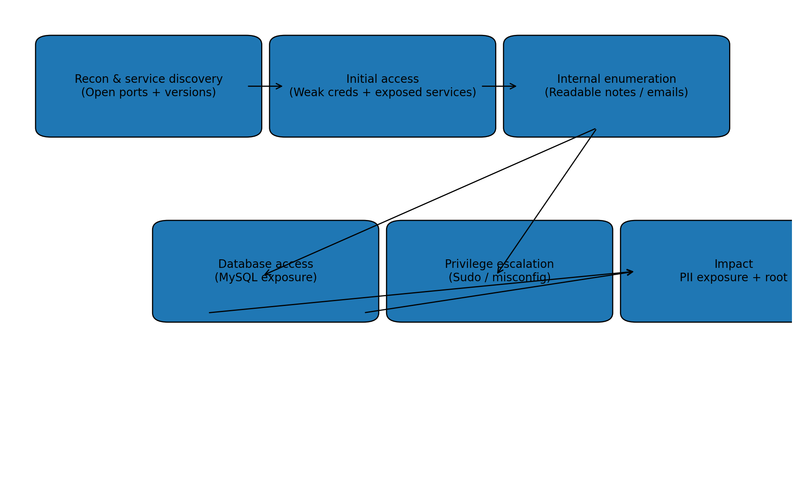
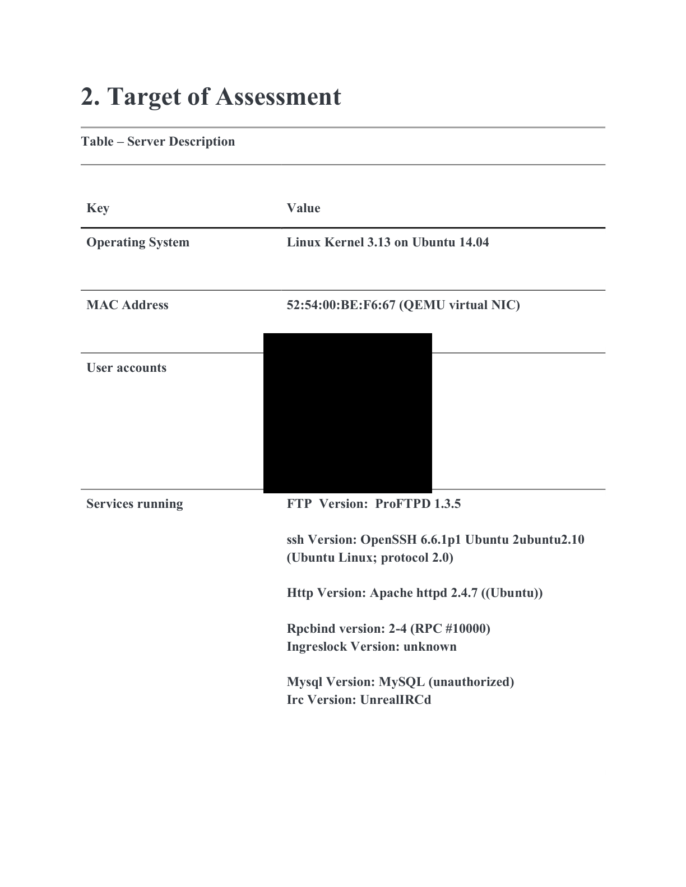
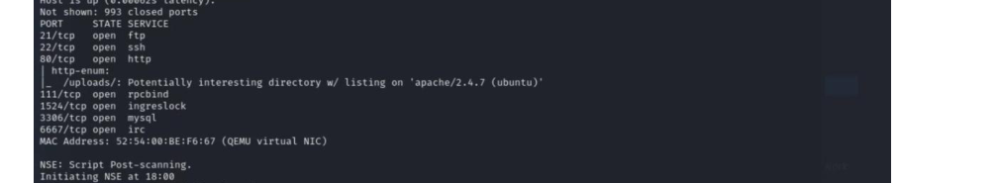
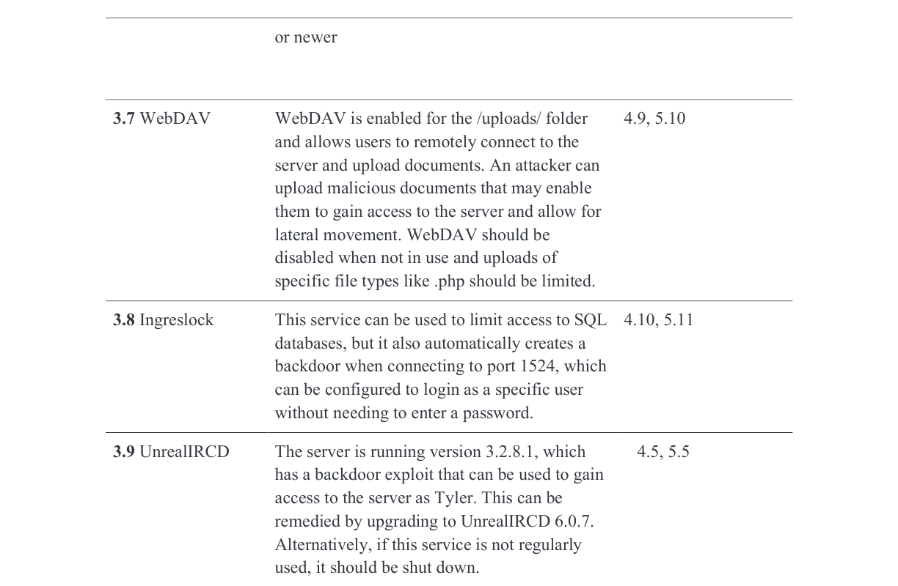
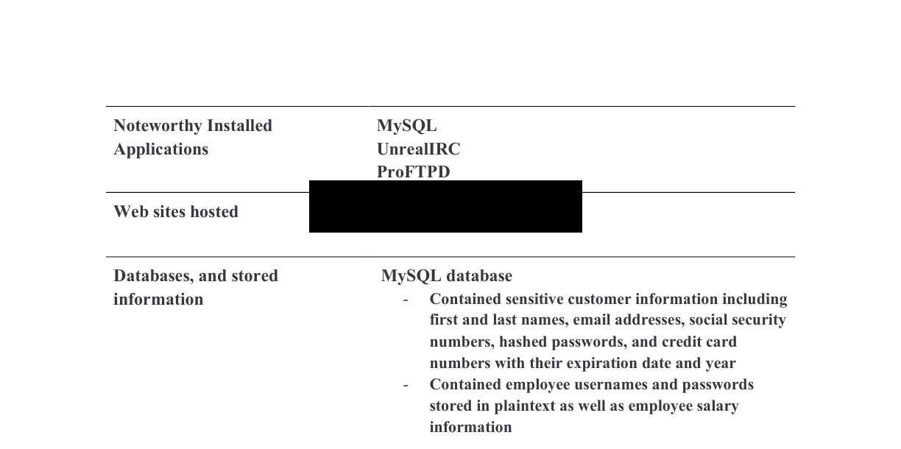
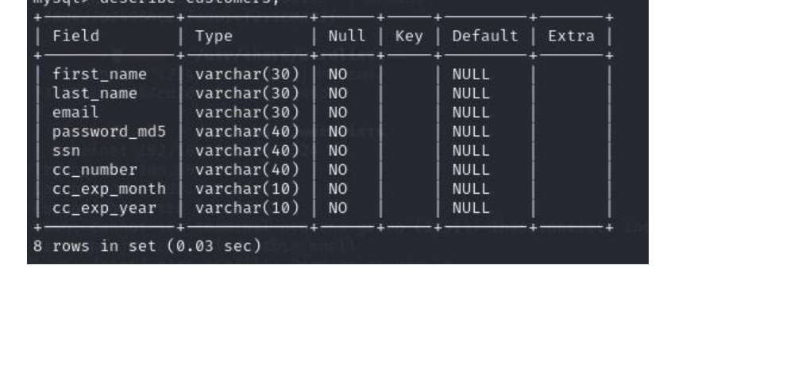
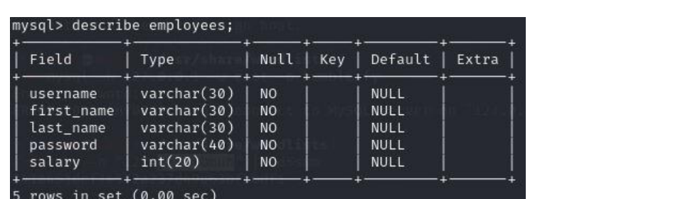
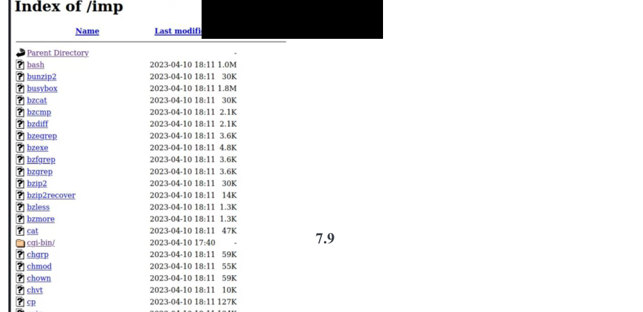

# Humblify Penetration Test — Technical Write‑Up (Sanitized)

> **Note:** This repository is a **sanitized** conversion of a penetration test report into a GitLab‑friendly README.
> Credentials, exploit payloads/strings, host IPs, and any customer/employee data values have been **redacted**.

---

## At a glance



### Key metrics (from assessment results)

| Metric | Value |
|---|---:|
| Engagement duration | ~3 weeks |
| Starting condition | Target IP only (no credentials / no architecture docs) |
| Hosts in scope | 1 Linux server (Ubuntu 14.04 / kernel 3.13) |
| Exposed TCP services discovered | **7** |
| Privilege obtained | **root** (post‑exploitation / privilege escalation) |
| Employee accounts impacted | **7** (credentials compromised / accessible) |
| Customer records exposed | **~430,000** customer records in MySQL |
| Sensitive data categories observed | SSNs, emails, password hashes, credit card numbers + exp date, employee salaries |


---

## Scope & environment

### Target

| Attribute | Value |
|---|---|
| OS | Linux Kernel 3.13 on Ubuntu 14.04 |
| Virtualization | QEMU virtual NIC (MAC redacted) |
| Primary installed apps | MySQL, UnrealIRCd, ProFTPD |
| Web surface | Apache HTTPD hosting a company site + employee portal |



### Rules of engagement (high level)

- Focus: external discovery → foothold → data access impact analysis → remediation guidance.
- Out of scope: denial‑of‑service / destructive actions.
- **Sanitization policy for this repo:** no passwords, no proof‑of‑concept exploit code, no injection strings, no PII values.

---

## Attack surface inventory

### Service & port inventory

The following externally reachable services were identified:

| Port | Proto | Service | Version / Notes | Risk snapshot |
|---:|:---:|---|---|---|
| 21 | TCP | FTP | ProFTPD 1.3.5 | Vulnerable module present (see Findings) |
| 22 | TCP | SSH | OpenSSH 6.6.1p1 (Ubuntu 2ubuntu2.10) | Outdated; hardening required |
| 80 | TCP | HTTP | Apache httpd 2.4.7 (Ubuntu) | App‑layer weaknesses enabled access paths |
| 111 | TCP | rpcbind | v2–4 (RPC #10000) | Unnecessary exposure (principle of least exposure) |
| 1524 | TCP | ingreslock | Unknown | Backdoor‑like service exposure |
| 3306 | TCP | MySQL | “unauthorized” banner (remote reachable) | Data store exposed + weak controls |
| 6667 | TCP | IRC | UnrealIRCd (backdoored version identified) | Remote command execution risk |




### Vulnerable service matrix (recreated)

| Component | Exposure | Vulnerability class | Reference | Practical risk |
|---|---|---|---|---|
| UnrealIRCd 3.2.8.1 | TCP/6667 | Backdoored build → remote command execution | CVE‑2010‑2075 | **Critical** takeover path if reachable |
| ProFTPD 1.3.5 (mod_copy) | TCP/21 | Arbitrary file copy/write via SITE commands | CVE‑2015‑3306 | **Critical** integrity compromise; can lead to RCE depending on target paths |
| Apache WebDAV (uploads) | HTTP/80 | Unsafe WebDAV methods enabled on uploads directory | (Config issue) | **Critical** file placement + potential code execution risk |
| Ingreslock | TCP/1524 | Backdoor/legacy service exposure | (Legacy/backdoor) | **Critical** unauthorized access path |

Visual reference (sanitized):





### Asset inventory (application/data)

| Asset | Description | Security impact |
|---|---|---|
| Public website | Marketing site hosted on Apache | Recon + potential app‑layer entry points |
| Employee portal | Authenticated portal (web) | Credential risk, lateral movement |
| MySQL database | Customer PII + payment data; employee creds + salary | Major confidentiality/PCI/PII exposure |
| IRC daemon | UnrealIRCd instance | High‑risk remote code execution (backdoor) |
| FTP service | ProFTPD 1.3.5 | Arbitrary file copy/write leading to takeover |



---

## Findings summary

| ID | Title | Severity | Primary impact |
|---|---|:---:|---|
| HMB‑01 | UnrealIRCd 3.2.8.1 backdoor (CVE‑2010‑2075) | **Critical** | Remote command execution |
| HMB‑02 | ProFTPD mod_copy arbitrary file copy/write (CVE‑2015‑3306) | **Critical** | Remote file write → service compromise |
| HMB‑03 | WebDAV enabled on uploads path | **Critical** | File upload misuse → code execution risk |
| HMB‑04 | Ingreslock service exposed (port 1524) | **Critical** | Backdoor access path present |
| HMB‑05 | Weak employee passwords (cracked in minutes) | **High** | Account takeover |
| HMB‑06 | Customer PII & payment data stored with weak protections | **High** | PII/PCI data exposure |
| HMB‑07 | Excessive database access / weak MySQL controls | **High** | Broad data exfiltration once inside |
| HMB‑08 | Local privilege escalation paths to root | **High** | Full host compromise |
| HMB‑09 | Sensitive personal notes stored on server | **Medium** | Operational security leakage |
| HMB‑10 | Sensitive access details in employee emails (stored unencrypted) | **Medium** | Credential & access pathway disclosure |
| HMB‑11 | Outdated OpenSSH | **Medium** | Increased attack surface + weak crypto defaults |

---

## Evidence snapshots (sanitized)

### Database schema indicates high‑risk PII/PCI fields

**Customers table (schema only; no rows):**



**Employees table (schema only; no rows):**



### Directory listing exposure (example)



---

## Detailed findings (technical)

> For safety, exploit strings and weaponized steps are removed. Each finding includes **defensive** validation checks you can run during remediation.

### HMB‑01 — UnrealIRCd 3.2.8.1 backdoor (CVE‑2010‑2075) — **Critical**

**What it is:** A trojaned UnrealIRCd 3.2.8.1 distribution (historically affected) enables remote command execution under the `ircd` runtime context.

**Why it mattered here:** The service was exposed on TCP/6667 and identified as the vulnerable line, providing a high‑confidence remote takeover path.

**Detection / validation (defensive):**
- Confirm package/version integrity:
  - Verify installed version and checksums (from vendor‑trusted sources).
  - Compare binaries against known‑good packages.
- Network exposure:
  - Restrict TCP/6667 at the firewall unless explicitly required.

**Fix:**
- Upgrade to a safe release (report recommendation: **UnrealIRCd 6.0.7**).
- Reinstall from trusted packages; rotate any secrets potentially exposed.

---

### HMB‑02 — ProFTPD mod_copy arbitrary file copy/write (CVE‑2015‑3306) — **Critical**

**What it is:** ProFTPD 1.3.5 with `mod_copy` can allow unauthorized file copy/write operations via FTP SITE commands (leading to serious integrity impacts and, depending on placement, code execution).

**Evidence:** Service version identified as **ProFTPD 1.3.5** on TCP/21.

**Detection / validation (defensive):**
- Confirm whether `mod_copy` is enabled in the configuration.
- Review FTP logs for suspicious SITE command usage patterns.

**Fix:**
- Upgrade to a fixed version (report recommendation: **ProFTPD 1.3.5a / 1.3.6rc1+**).
- If upgrade isn’t immediate, disable `mod_copy` and restrict FTP access.

---

### HMB‑03 — WebDAV enabled on uploads path — **Critical**

**What it is:** WebDAV was enabled and accessible on an uploads directory. When combined with permissive methods and weak server‑side validation, this creates a path for malicious file placement and potential code execution.

**Detection / validation (defensive):**
- Run an **OPTIONS** request and review `Allow` / `DAV` headers.
- Confirm write methods (PUT/MKCOL/etc.) are disabled unless required.
- Verify uploads are stored outside the web root and served as static content only.

**Fix:**
- Remove WebDAV if not required (report recommendation).
- If required: enforce auth, disable unsafe verbs, and gate behind VPN/internal network.

---

### HMB‑04 — Ingreslock service exposed (port 1524) — **Critical**

**What it is:** `ingreslock` on TCP/1524 is commonly associated with legacy/backdoor access paths and should not be exposed.

**Fix:**
- Remove/disable the service (report recommendation).
- Add port‑level deny rules at host firewall and perimeter.

---

### HMB‑05 — Weak employee passwords — **High**

**What it is:** Employee credentials were weak enough to be recovered rapidly via password auditing.

**Impact:**
- Enabled authenticated access to internal services and broader data exposure.

**Fix:**
- Enforce strong passphrases (report recommendation: **4‑word passphrase**).
- Implement MFA where possible.
- Add lockout/rate‑limit controls; monitor auth failures.

---

### HMB‑06 — Customer PII & payment data stored with weak protections — **High**

**What it is:** MySQL contained high‑value PII/PCI fields and used weak hashing (e.g., MD5) for password storage.

**Impact:**
- Large‑scale confidentiality exposure (SSNs, payment card data, etc.).
- Elevated regulatory and breach notification risk.

**Fix:**
- Apply cryptographic best practices:
  - Passwords: use modern salted password hashing (bcrypt/scrypt/Argon2).
  - PII/PCI: tokenize or encrypt at rest (KMS/HSM), minimize collection, restrict access.
- Report recommendation mentions hashing certain fields with SHA‑256; in practice, prefer **encryption/tokenization** for reversible requirements and **strong password hashing** for authentication secrets.

---

### HMB‑07 — Excessive database access / weak MySQL controls — **High**

**What it is:** Database access was broader than necessary (employees could access data beyond job role; MySQL reachable remotely).

**Fix:**
- Restrict MySQL network exposure (bind to localhost/internal subnet).
- Implement least‑privilege DB roles:
  - Separate app user vs admin user.
  - Column‑level permissions for PII tables where feasible.
- Rotate credentials; enable auditing (general log / audit plugin where appropriate).

---

### HMB‑08 — Local privilege escalation paths to root — **High**

**What it is:** The host contained executable paths that enabled elevation to root once a foothold was established.

**Fix:**
- Remove/lock down unsafe SUID/SGID binaries; tighten sudoers.
- Patch OS; run baseline hardening (CIS) and periodic permission audits.

---

### HMB‑09 — Sensitive personal notes on server — **Medium**

**What it is:** Employees stored notes with sensitive access/security information in user files.

**Fix:**
- Prohibit secrets in plaintext files on shared hosts.
- Use a secrets manager + encrypted notes vault; implement DLP scanning.

---

### HMB‑10 — Sensitive access details in employee emails — **Medium**

**What it is:** Emails included access instructions and were stored unencrypted in user directories.

**Fix:**
- Use encrypted channels for operational access details.
- Disable local email storage on servers; enforce retention/secure storage.

---

### HMB‑11 — Outdated OpenSSH — **Medium**

**What it is:** OpenSSH version was outdated relative to current supported releases.

**Fix:**
- Upgrade OpenSSH (report recommendation: **9.2**).
- Disable password auth where possible; enforce key‑based auth + MFA jump host.

---

## Remediation roadmap (prioritized)


### P0 (Immediate containment)
1. Remove/disable **ingreslock** and block TCP/1524.
2. Take **UnrealIRCd** offline or firewall it; upgrade/reinstall from trusted sources.
3. Disable WebDAV or restrict to authenticated/internal usage only.
4. Restrict MySQL exposure to internal interfaces; rotate DB credentials.

### P1 (Hardening + least privilege)
1. Upgrade ProFTPD and disable unsafe modules.
2. Implement role‑based DB accounts; minimize PII surface area.
3. Enforce strong passphrases + MFA; improve logging/alerting.

### P2 (Sustained security program)
1. OS patching cadence, CIS hardening, and continuous vulnerability scanning.
2. Secrets management + secure comms policy for operational access.
3. Regular red‑team / purple‑team retesting.

---


### Report remediation items (recreated)

| Ref | Area | Recommendation (as stated in report) |
|---|---|---|
| 5.1 | MySQL | Restrict DB access to required users; strengthen DB password (4‑word passphrase recommended). |
| 5.2 | Customer PII | Protect DB better; hash sensitive fields (report mentions SHA‑256 for SSN/email/CC fields). |
| 5.3 | Root access | Remove executable files/misconfigurations enabling root. |
| 5.4 | Passwords | Enforce 4‑word passphrases; replace MD5 with stronger hashing (report mentions SHA‑256). |
| 5.5 | UnrealIRCD | Upgrade to **UnrealIRCd 6.0.7**. |
| 5.6 | OpenSSH | Upgrade to **OpenSSH 9.2**. |
| 5.7 | ProFTPD | Upgrade to **ProFTPD 1.3.5a / 1.3.6rc1+**. |
| 5.8 | Personal notes | Avoid storing sensitive notes in unprotected files on the server. |
| 5.9 | Employee emails | Avoid sharing access details via unencrypted email; do not store emails in user files on servers. |
| 5.10 | WebDAV | Remove WebDAV if not necessary; otherwise disable when not in use and restrict tightly. |
| 5.11 | Ingreslock | Remove the Ingreslock service entirely. |


## Tooling & scripts (this repo)

This repo includes **defensive** recon and validation helpers used to build the service inventory and to support remediation verification.

| Script | Purpose | Output |
|---|---|---|
| `scripts/recon_nmap.sh` | Full TCP scan + service detection + HTTP scripts | Nmap `.nmap/.gnmap/.xml` in `artifacts/nmap/` |
| `scripts/nmap_xml_to_md.py` | Convert Nmap XML to a Markdown service table | `artifacts/service_inventory.md` |
| `scripts/webdav_probe.py` | Check for WebDAV exposure via OPTIONS | Console findings (methods/DAV headers) |
| `scripts/mysql_schema_audit.sql` | Read‑only schema & hygiene checks (no PII dump) | Schema + counts |

### Example: run recon (authorized environments only)

```bash
bash scripts/recon_nmap.sh <TARGET_IP_OR_HOST>
python3 scripts/nmap_xml_to_md.py artifacts/nmap/full_tcp.xml > artifacts/service_inventory.md
python3 scripts/webdav_probe.py http://<TARGET_HOST>/uploads/
```

---

## Mapping to MITRE ATT&CK (high level)

| Phase | ATT&CK tactic | Examples in this engagement |
|---|---|---|
| Recon | Reconnaissance | Service discovery + version fingerprinting |
| Initial access | Initial Access | Remote service/app weaknesses on exposed ports |
| Credential access | Credential Access | Weak credentials + insecure storage in DB/files |
| Privilege escalation | Privilege Escalation | Local escalation paths to root |
| Collection | Collection | Database schema + sensitive data identification |
| Exfiltration | Exfiltration | (Simulated) ability to access customer datasets |

---

## Repository structure

```
.
├── README.md
├── assets/          # Redacted screenshots & diagrams
├── scripts/         # Recon + validation helpers (sanitized)
└── artifacts/       # Generated outputs (optional; local)
```

---

## Disclaimer

This write‑up is for **authorized security testing** and defensive learning only. Any exploit payloads, cracked passwords, and PII values from the original report were intentionally removed.
