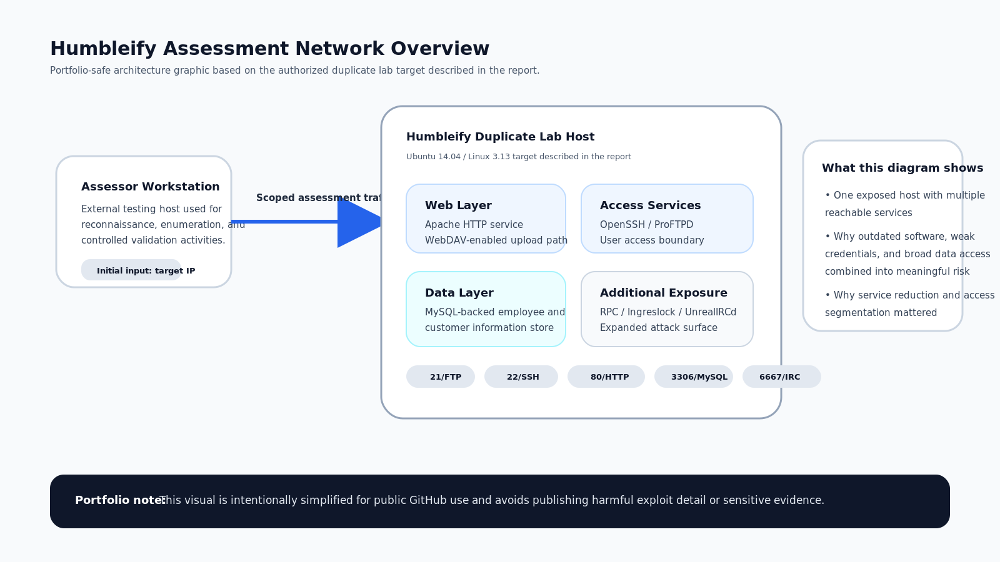
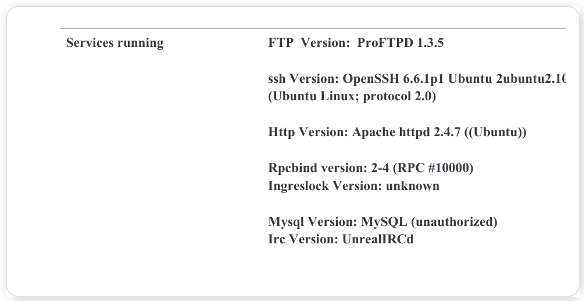
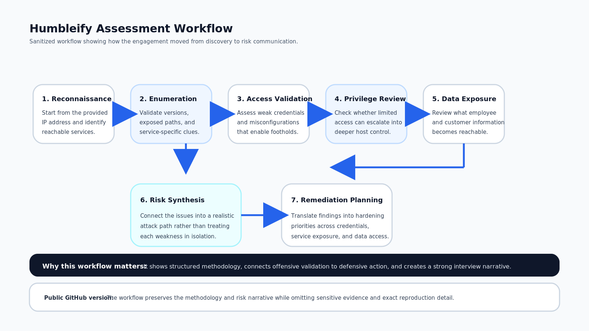
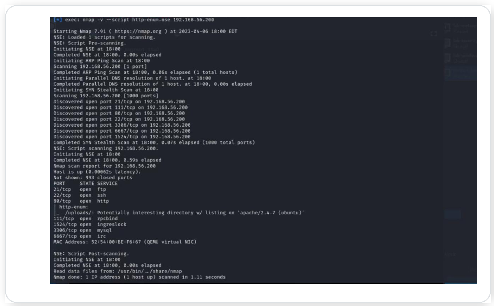

# Humbleify Penetration Test (Sanitized Case Study)

This repository presents a **sanitized penetration testing case study** based on an authorized assessment of a duplicate Humbleify server in a controlled lab environment. The engagement began with only the target IP address and focused on identifying exploitable weaknesses, assessing sensitive data exposure, and translating findings into practical remediation actions.

This version is intentionally prepared for a **public GitHub portfolio**. It highlights methodology, security reasoning, and communication skill while omitting raw credentials, sensitive records, and exact exploit reproduction detail.



## Why This Project Matters

This project demonstrates more than tool usage. It shows how an attacker can move from a limited starting point to broader compromise by chaining together:

- exposed services
- weak credential hygiene
- insecure configurations
- poor operational security
- overly broad access to sensitive data

From a recruiter and hiring-manager perspective, this project highlights:
- penetration testing methodology
- service enumeration and attack-surface analysis
- credential and access-path assessment
- privilege-escalation thinking
- sensitive data exposure analysis
- remediation planning and professional reporting

## Engagement Scope

- **Assessment type:** Authorized penetration test / vulnerability assessment
- **Target:** Single Humbleify lab asset
- **Environment:** Duplicate development version of the target system
- **Starting point:** Target IP address only
- **Constraints:** No social engineering, no interference with other teams, no disclosure outside scope

## Target Environment

Based on the original report, the assessed host was an Ubuntu-based server exposing several services relevant to the engagement, including:

- ProFTPD
- OpenSSH
- Apache HTTP
- MySQL
- RPC-related services
- UnrealIRCd

### Target Services Summary


*Selected portfolio-safe crop from the original report showing the primary services identified during the assessment.*

## Assessment Workflow

The project followed a structured workflow from reconnaissance through remediation planning.



At a high level, the assessment covered:

1. **Reconnaissance** - Identify exposed services and the external attack surface.
2. **Enumeration** - Validate versions, accessible paths, and service-specific clues.
3. **Access validation** - Assess weak credentials and misconfigurations that could provide footholds.
4. **Privilege review** - Determine whether limited access could be expanded into broader control.
5. **Data exposure review** - Evaluate what sensitive information became reachable after compromise.
6. **Risk synthesis** - Connect the issues into a realistic attack path.
7. **Remediation planning** - Translate technical findings into defensive priorities.

## Selected Evidence

### Nmap Service Enumeration


*Portfolio-safe evidence crop from the original report showing representative network and service discovery output.*

## Key Findings

### 1. Weak Credential Hygiene
Weak or guessable credentials increased the likelihood of unauthorized account access and enabled deeper internal reconnaissance.

### 2. Excessive Access to Sensitive Data
The environment exposed highly sensitive employee and customer information, demonstrating insufficient access segmentation and data protection.

### 3. Privilege Escalation Paths
The assessment identified routes from limited access to elevated privileges, increasing the likelihood of full host compromise.

### 4. Vulnerable or Misconfigured Services
Service exposure materially contributed to the overall risk posture. Outdated or insecure components expanded the available attack surface and enabled additional attack paths.

### 5. Insecure Operational Practices
Accessible notes, stored communications, and internal guidance accelerated attacker reconnaissance and reduced the effort required to exploit other weaknesses.

## Representative Tools and Techniques

This project involved practical use of security testing and validation tooling, including:

- Nmap
- Hydra
- Hashcat
- Metasploit
- davtest
- SSH / Telnet / MySQL client utilities

## Security Concepts Demonstrated

- network reconnaissance and service enumeration
- attack-surface analysis
- credential attack assessment
- privilege-escalation analysis
- sensitive data exposure review
- attack-path chaining
- remediation planning
- technical reporting for mixed audiences

## Repository Structure

```text
Humbleify-Penetration-Test/
├── README.md
├── assets/
│   ├── diagrams/
│   │   ├── 01-humbleify-network-architecture.png
│   │   ├── 01-humbleify-network-architecture.svg
│   │   ├── 02-humbleify-assessment-workflow.png
│   │   └── 02-humbleify-assessment-workflow.svg
│   └── screenshots/
│       ├── 01-target-services-summary.png
│       └── 02-nmap-service-enumeration.png
└── docs/
    ├── asset-captions.md
    └── upload-guide.md
```

## Recommended GitHub Positioning

For a public portfolio, this project is strongest when positioned as a **sanitized case study** that demonstrates:

- offensive security methodology
- security engineering judgment
- ability to explain impact clearly
- professional handling of sensitive material

## Resume-Ready Project Bullets

- Conducted an authorized penetration test of a duplicated Ubuntu-based web environment, identifying exploitable weaknesses across authentication, service exposure, privilege boundaries, and sensitive data access.
- Demonstrated how weak credentials, insecure services, and poor operational security could be chained into broader compromise of application and backend assets.
- Assessed exposure of sensitive employee and customer data and translated findings into remediation guidance covering access control, service hardening, software updates, and operational security.
- Produced a structured technical report with evidence, impact analysis, and remediation recommendations suitable for both technical and non-technical stakeholders.

## Public Portfolio Note

This repository intentionally omits raw credentials, sensitive records, exact exploit steps, and harmful operational detail. The goal is to demonstrate methodology and security thinking in a professional, responsible format.

## Disclaimer

This work was performed in an authorized lab setting against an in-scope duplicate target for academic and educational purposes. It is shared here as a sanitized portfolio artifact.
