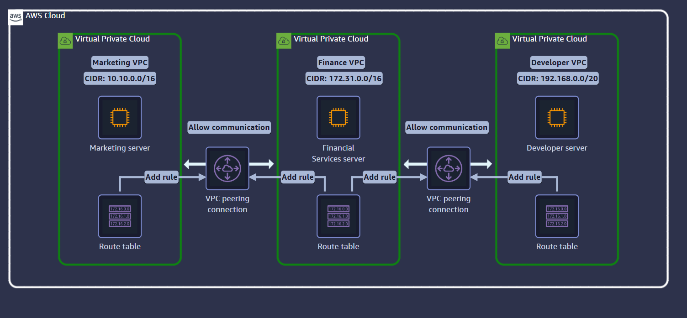
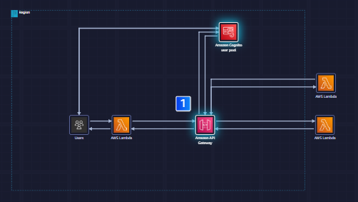
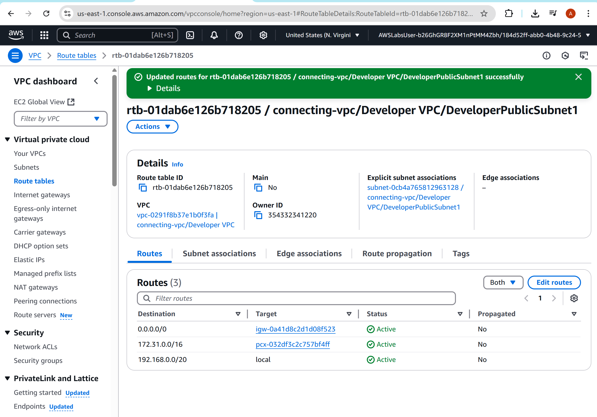
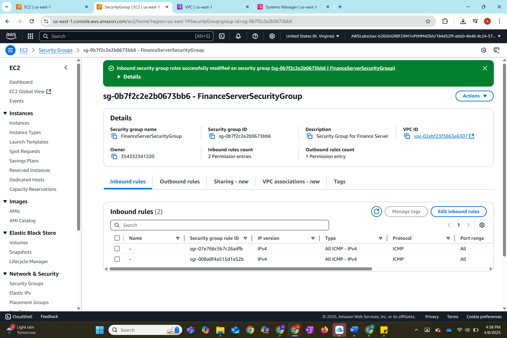
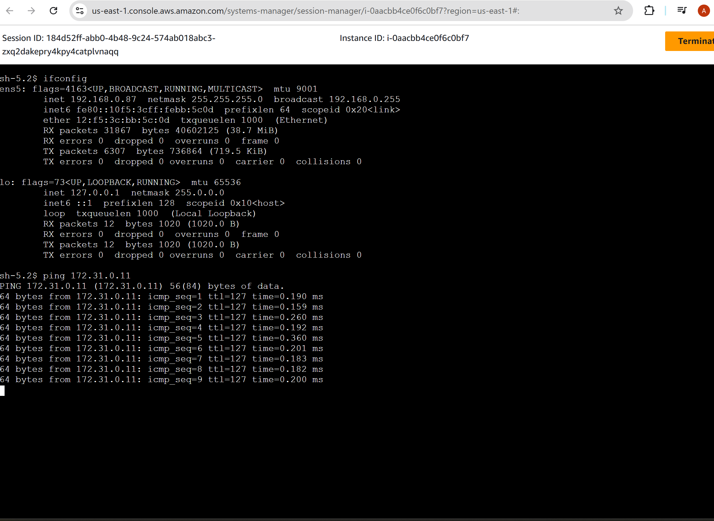
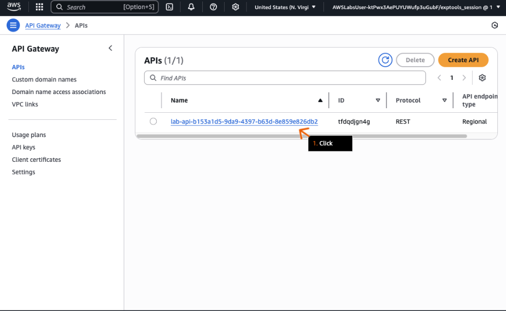
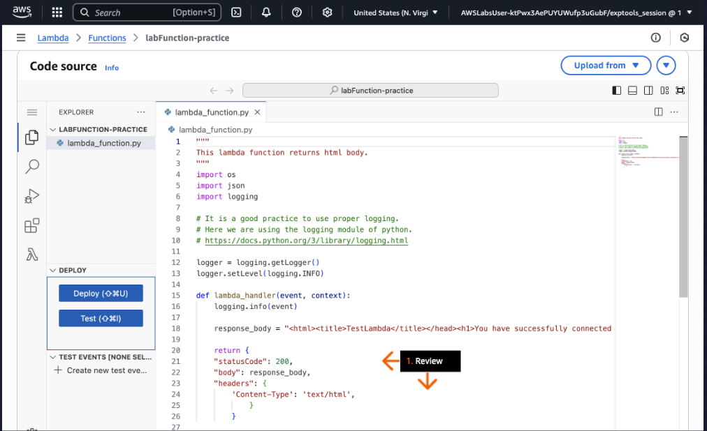
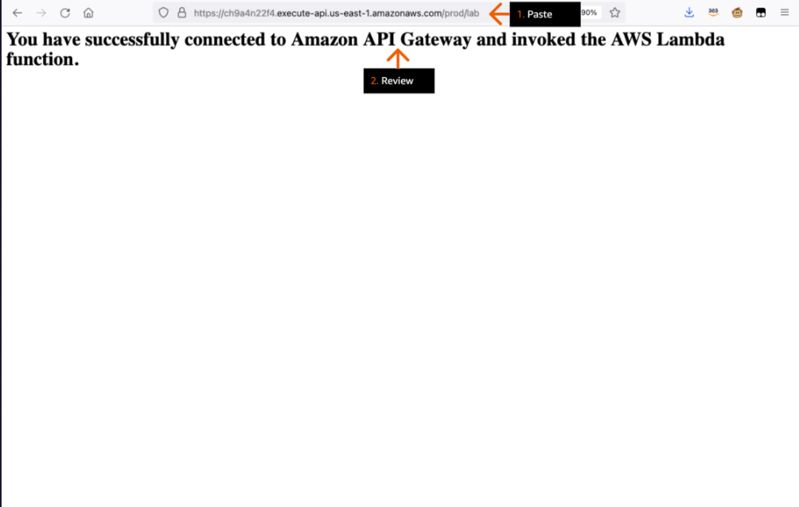

# Secure Inter‑VPC Networking & Zero‑Trust APIs (VPC Peering + Cognito + API Gateway + WAF)

## Summary
This combined lab demonstrates how to design and enforce **secure network communication** across AWS VPCs and **zero‑trust API access**. It integrates **VPC Peering** (for east‑west traffic between departmental VPCs) with **Amazon Cognito + API Gateway** (for authenticated north‑south API access), optionally fronted by **AWS WAF**. The result is a governed path for users to authenticate, call APIs, and reach backend services hosted across peered VPCs—while preserving isolation and least privilege.


---

## Architecture Overview
- **Network plane:** Two VPCs (Marketing & IT) with distinct CIDR blocks are **peered**. Route tables allow only the required inter‑VPC traffic; **Security Groups** and **NACLs** restrict access. **SSM Session Manager** is used for keyless, port‑closed instance access.
- **API plane (Zero‑Trust):** **Amazon Cognito** issues ID tokens; **API Gateway** validates tokens via a user‑pool **JWT authorizer**, invokes **AWS Lambda**, and returns responses. **AWS WAF** (optional) adds rate‑limits and managed rules (SQLi/XSS). **CloudWatch Logs** provide auditing.





---

## Part A — Inter‑VPC Connectivity with VPC Peering
### Goals
- Isolate departments by VPC while enabling specific internal communication.
- Avoid exposing instances to the Internet and avoid SSH keys; use **SSM** instead.
- Enforce least privilege via **route tables + SG/NACL**.

### Steps
1. **Plan CIDRs & create VPCs**  
   - Example: *Marketing:* `10.10.0.0/16`; *IT:* `10.20.0.0/16` (no overlap).  
   - Create subnets and associate route tables.
   

2. **Launch test instances with SSM**  
   - Enable SSM Agent; attach required IAM role. Prefer **VPC endpoints** for SSM to remove Internet dependency (optional).
   

3. **Create & accept VPC peering**  
   - Initiate from one VPC; accept from the peer. Note: **no transitive routing**; update each side’s routes.
   

4. **Configure route tables**  
   - Add routes so each VPC can reach the other’s CIDR. Keep Internet routes only where needed.
   

5. **Tighten SG/NACL**  
   - Allow only required protocols between instances (e.g., ICMP for validation, app ports for services).
   

6. **Validate connectivity**  
   - Use **SSM** to connect and `ping`/`curl` between instances across VPCs to confirm peering.
   

**Outcomes**
- Secure communication established between two departments with isolation preserved.
- Keyless, port‑closed access model via SSM improves posture.
- Clear blast‑radius boundaries and explicit routing.

---

## Part B — Secure API with Cognito + API Gateway (+ WAF)
### Goals
- Require **strong authentication** for API access.
- Validate **JWT tokens** at the edge before invoking backend logic.
- Add **WAF** protections and centralized logging.

### Steps
1. **Create Amazon Cognito User Pool**  
   - Configure domains, app client, and hosted UI if desired.
   

2. **Deploy API Gateway + Lambda**  
   - Create a **Regional** API; add methods that invoke Lambda functions. Enable execution logging.  
   

3. **Configure JWT Authorizer (Cognito)**  
   - Point the authorizer at the user pool; set audience and token source (`Authorization` header).
   

4. **Obtain & test tokens**  
   - Authenticate to Cognito; capture **ID token**. Call API with `Authorization: Bearer <ID_TOKEN>`.
   

5. **Add AWS WAF (optional but recommended)**  
   - Attach a WebACL to API Gateway; enable **AWS Managed Rules**, **rate limiting**, and **IP allow/deny lists**.
   

6. **Observe & audit**  
   - Use **CloudWatch Logs** to track requests, denials, and Lambda outcomes.
   

**Flow Summary**
1. User signs in to Cognito → receives tokens.  
2. Client calls API Gateway with **ID token**.  
3. Authorizer validates token; if valid, method executes Lambda.  
4. Lambda returns a response via API Gateway; WAF enforces rules throughout.

---

## Security & Compliance Considerations
- **Least Privilege IAM** for EC2/SSM, Lambda, and API Gateway.  
- **No inbound SSH**; SSM Session Manager for administration.  
- **Resource policies** and **WAF** to restrict API access patterns.  
- **Logging & metrics:** CloudWatch metrics/alarms; export to SIEM for detection use‑cases.  
- **Network isolation:** Separate VPCs, explicit routes, deny by default in SG/NACL.

---

## How to Reproduce

### Prerequisites
- AWS account; IAM permissions for VPC, EC2, SSM, API Gateway, Cognito, Lambda, WAF, CloudWatch.
- (Optional) VPC endpoints for SSM to keep instances private.

### Part A — VPC Peering
1. Create **Marketing** and **IT** VPCs with non‑overlapping CIDRs.  
2. Create subnets + route tables; launch one EC2 per VPC with SSM role attached.  
3. Create VPC peering; accept on the peer VPC.  
4. Update route tables on **both** VPCs to the opposite CIDR.  
5. Restrict SG/NACL; allow only required ports (temporary ICMP for ping).  
6. Validate via SSM: `ping`, `curl` between instances.

### Part B — Secure API
1. Create a **Cognito user pool** and app client.  
2. Build a **Regional API Gateway** + **Lambda** integration.  
3. Add a **JWT authorizer** pointing to the user pool; require it on methods.  
4. Acquire token; test calls with `Authorization: Bearer <ID_TOKEN>`.  
5. (Optional) Attach **AWS WAF** to API Gateway; enable managed rules.  
6. Monitor CloudWatch logs and set alarms.

---

## Repository Structure
```
.
├─ Screenshots/                 # Curated screenshots referenced below
├─ lambda/                      # (optional) Lambda sources
├─ api/                         # (optional) API Gateway/SAM/CDK configs
├─ vpc/                         # (optional) VPC templates or diagrams
└─ README.md
```

---

## Screenshots (expected filenames)
- `01a-vpc-architecture.png`
- `01b-api-architecture.png`
- `02-vpc-topology.png`
- `03-vpc-peering-connection.png`
- `04-route-tables.png`
- `05-ssm-session.png`
- `06-ping-test.png`
- `07-security-groups.png`
- `08-cognito-user-pool.png`
- `09-cognito-app-client.png`
- `10-api-gateway-authorizer.png`
- `11-api-gateway-method-auth.png`
- `12-id-token-test.png`
- `13-waf-web-acl.png`
- `14-cloudwatch-logs.png`

> If your screenshots use different names, rename them to match the list above so links render automatically.

---

## Metrics & Talking Points
- **Zero inbound SSH** posture; SSM for access.  
- **Token‑enforced APIs** with JWT validation at API Gateway.  
- **Measured outcomes:** time‑to‑enable cross‑VPC comms, **% private access paths**, error/deny rates from WAF, **MTTR** for API issues.

---

## Author
Allie Evan — Cloud & Security Engineering Portfolio
