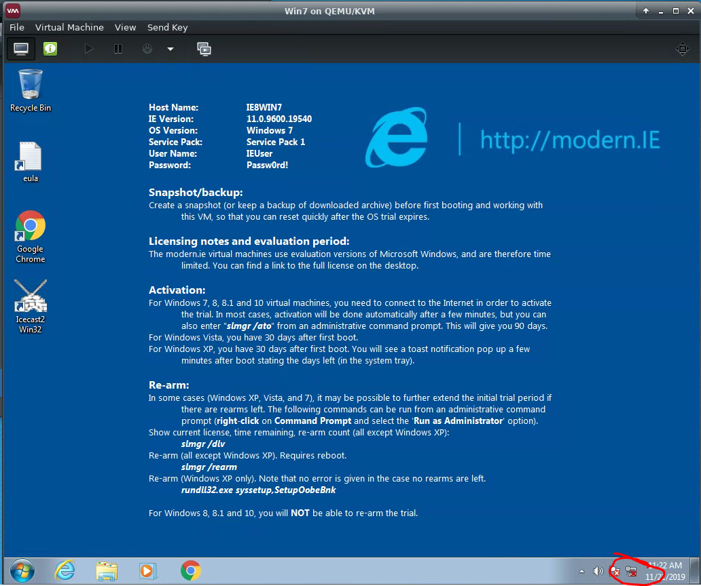
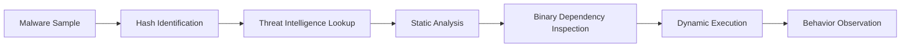
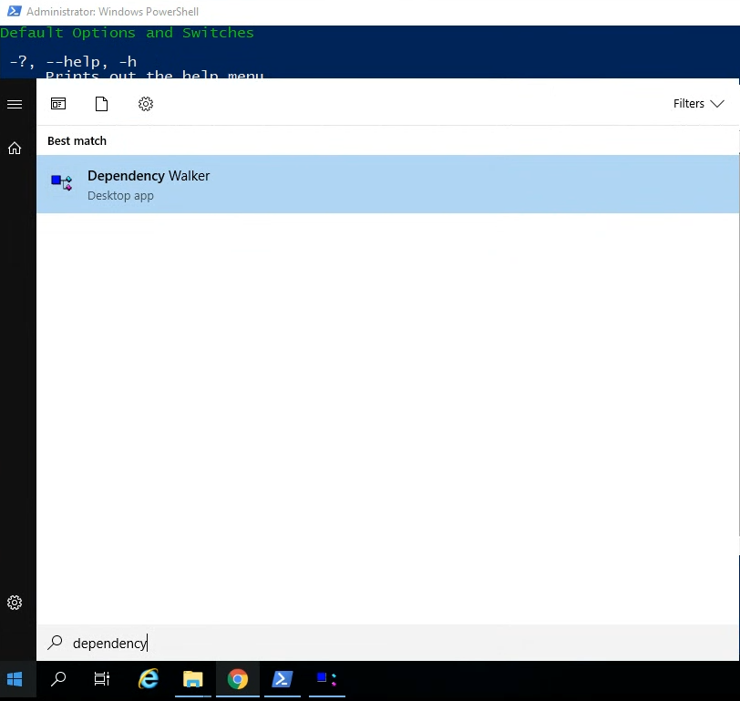
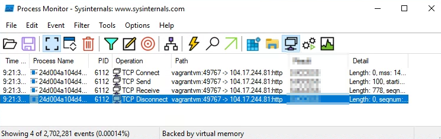
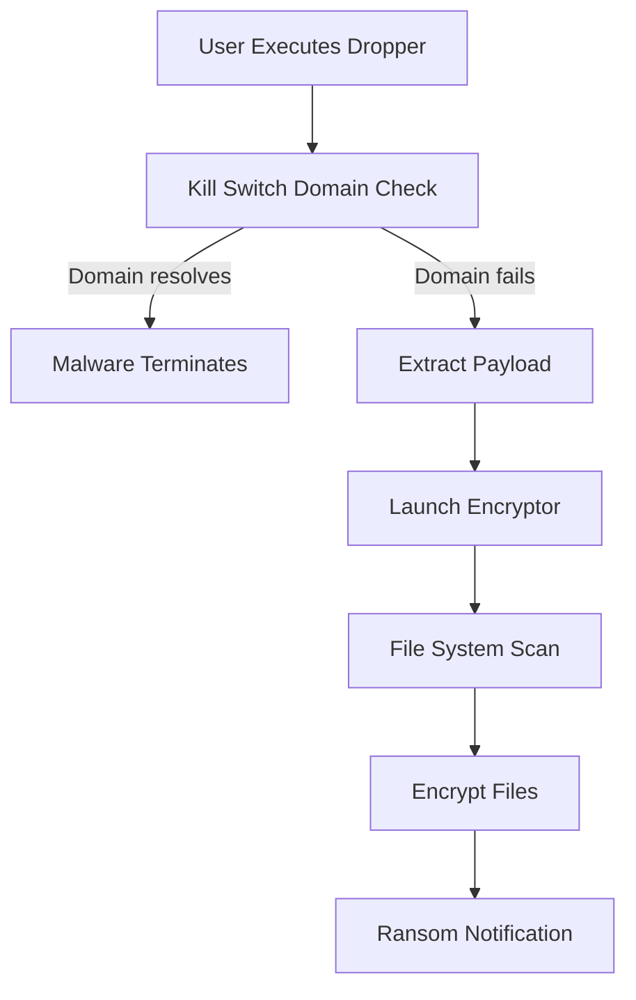

# WannaCry Malware Analysis (Static + Dynamic Analysis)

Static and dynamic analysis of the **WannaCry ransomware** sample performed in a controlled virtual lab environment.
This project demonstrates how malware analysts investigate suspicious binaries, safely observe runtime behavior, and extract indicators useful for detection and response.

---

# Overview

**WannaCry** is a ransomware worm responsible for a global cyber outbreak in May 2017.  
It exploited the **EternalBlue SMB vulnerability (MS17‑010)** to propagate across networks and encrypt victim files.

Once executed, WannaCry:

1. Checks a kill‑switch domain
2. Extracts an embedded ransomware payload
3. Scans the system for target files
4. Encrypts files using Windows cryptographic APIs
5. Displays a ransom demand

---

# Lab Environment

Malware analysis was conducted inside a **sandboxed virtual machine environment** to prevent accidental system compromise.

## Virtual Analysis Architecture

Kali Linux Host → Windows VM Sandbox → Malware Sample

| Component | Purpose |
|---|---|
| Kali Linux | Host virtualization platform |
| Windows VM | Malware execution sandbox |
| Sysinternals Tools | Static & dynamic analysis |
| Process Monitor | Runtime event monitoring |
| Dependency Walker | DLL dependency inspection |
| Resource Hacker | Binary resource analysis |

---

# Virtual Machine Sandbox

The malware was executed inside a **Windows virtual machine** running within a Kali Linux host.



Snapshots were created before execution to allow quick restoration after infection.

---

# Malware Analysis Workflow

The investigation followed a typical malware triage workflow used by incident response and threat intelligence teams.



---

# Phase 1 – File Identification

Hashes were generated to uniquely identify the executable.

```powershell
get-filehash sample.exe
get-filehash -algorithm MD5 sample.exe
```

Hashes allow analysts to:

- search malware intelligence platforms
- confirm malware family classification
- track known malicious samples

Threat intelligence sources used:

- VirusTotal
- Hybrid Analysis

---

# Phase 2 – Static Analysis

Static analysis extracts information from a binary **without executing the malware**.

## Strings Analysis

The Sysinternals **Strings** utility was used to extract readable text embedded in the binary.

```bash
strings -n 12 malware.exe > output.txt
```

Findings included:

- kill‑switch domain
- Windows API calls
- encryption-related functions
- suspicious URLs

---

# Binary Dependency Analysis

Dependency Walker was used to inspect Windows libraries imported by the malware.



Key DLLs identified:

- ADVAPI32.dll
- bcrypt.dll
- kernel32.dll

These libraries provide **Windows cryptographic functionality**, confirming the ransomware’s encryption capabilities.

---

# Phase 3 – Dynamic Analysis

Dynamic analysis observes malware behavior while it executes in a sandbox.

## Runtime Network Activity

Process Monitor was used to monitor runtime events and network connections.



Observed behaviors included:

- outbound TCP connections
- process execution activity
- file system changes

The malware attempts to reach a **kill‑switch domain** before executing encryption routines.

---

# Malware Execution Flow

The runtime behavior observed during analysis can be summarized below.



This mechanism explains why registering the kill‑switch domain halted the global outbreak.

---

# Ransomware Behavior

Once active, WannaCry:

1. scans the system for files with specific extensions
2. encrypts files using Windows crypto APIs
3. renames encrypted files with the `.WNCRY` extension
4. displays ransom instructions

Encrypted files contain a **signature header (“magic number”)** identifying WannaCry‑encrypted content.

---

# MITRE ATT&CK Mapping

Observed behaviors align with several MITRE ATT&CK techniques.

| Tactic | Technique | Description |
|---|---|---|
Initial Access | T1210 – Exploitation of Remote Services | EternalBlue SMB exploit |
Execution | T1059 – Command Execution | Malware payload execution |
Discovery | T1083 – File and Directory Discovery | Scans for files to encrypt |
Impact | T1486 – Data Encrypted for Impact | Ransomware encryption |

---

# Indicators of Compromise (IOCs)

| Type | Indicator |
|---|---|
Malware Family | WannaCry |
Kill Switch Domain | iuqerfsodp9ifjaposdfjhgosurijfaewrwergwea.com |
Dropped Payload | tasksche.exe |
Encrypted File Extension | .WNCRY |

These indicators can assist defenders in detecting WannaCry infections.

---

# Defensive Insights

This analysis highlights several key defensive lessons.

### Patch Management
WannaCry spreads through the **EternalBlue vulnerability**, which affects unpatched SMB services.

### Network Monitoring
Unusual outbound DNS or TCP connections can indicate malware execution.

### Offline Backups
Maintaining offline backups remains the most reliable defense against ransomware.

---

# Tools Used

| Tool | Purpose |
|---|---|
VirusTotal | Threat intelligence lookup |
Hybrid Analysis | Sandbox reports |
Sysinternals Strings | Binary inspection |
Resource Hacker | Resource extraction |
Dependency Walker | DLL analysis |
Process Monitor | Runtime monitoring |

---

# Skills Demonstrated

- Malware triage
- Static binary analysis
- Dynamic malware analysis
- Windows process investigation
- Threat intelligence research
- Ransomware behavior analysis

---

# Author

Alexandra Evan  
Cybersecurity Analyst  

GitHub: https://github.com/alevan22
