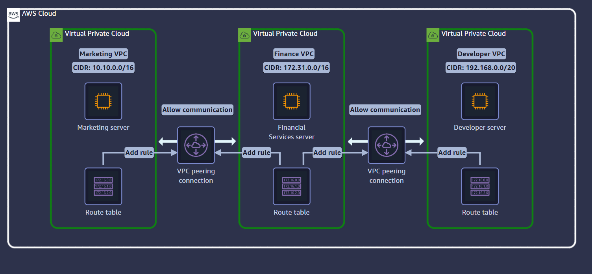
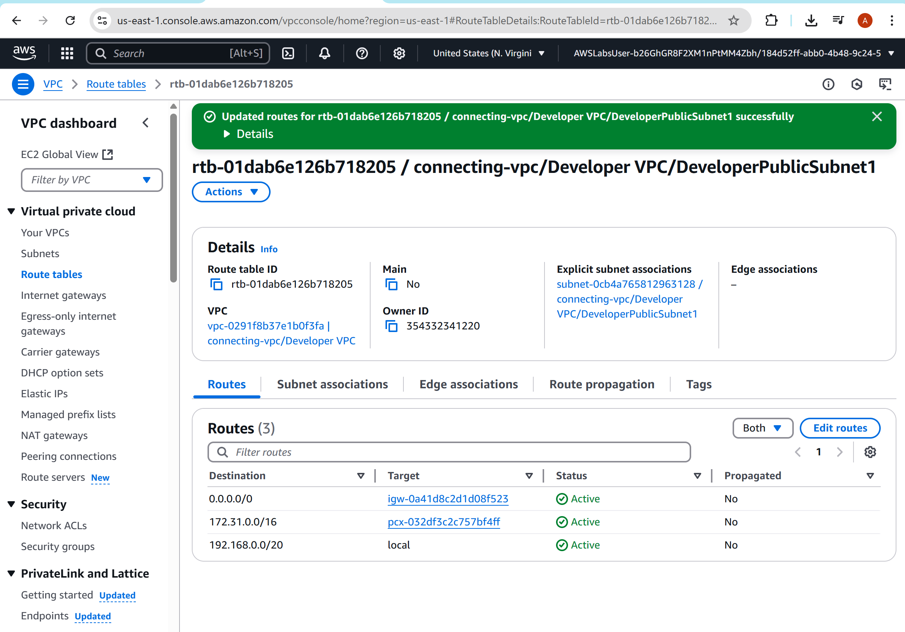

# AWS VPC Peering: Marketing & IT Department Lab

This lab demonstrates how to implement **secure and functional VPC peering** between two Amazon Virtual Private Clouds in a simulated multi-department enterprise environment

---

## 📘 Scenario

The city’s **Marketing department** requires its own isolated VPC while still being able to communicate with the **IT department’s VPC**. As a cloud security engineer, your task is to set up **VPC peering** to enable internal communication while maintaining logical isolation.

---

## 🧪 Lab Objectives

- Understand how **VPC peering** enables inter-VPC communication
- Create and configure route tables to support secure traffic routing
- Validate communication between instances in separate VPCs

---

## 🛠️ AWS Services Used

- **Amazon VPC** – for creating isolated networks
- **Amazon EC2** – for launching test instances
- **Amazon Systems Manager (SSM)** – for secure access to EC2
- **Route Tables** – for customizing routing
- **VPC Peering** – to establish inter-VPC links

---

## 🧭 Steps Taken & Corresponding Screenshots

### ✅ 1. Reviewed Architecture Requirements
I reviewed the proposed architecture: users authenticate via Amazon Cognito, invoke Lambda via API Gateway, and route traffic between two VPCs.

📷 

---

### ✅ 2. Created Two VPCs
- Created `Marketing VPC` and `IT VPC` with distinct CIDR blocks.
- Launched one EC2 instance in each VPC with SSM enabled.

---

### ✅ 3. Established VPC Peering
- Created a **VPC peering connection** between the two VPCs.
- Accepted the request on the peer VPC side.

---

### ✅ 4. Configured Route Tables
- Updated the **Marketing VPC’s route table** to allow routing to the IT VPC (172.31.0.0/16).
- Ensured public subnet had internet access via IGW.

📷 

---

### ✅ 5. Verified Connectivity with Ping
- Used AWS Systems Manager (SSM) to securely connect to the EC2 instance.
- Successfully pinged the EC2 instance in the IT VPC from the Marketing VPC to validate peering.

📷 

---

## ✅ Outcome

- **Established secure communication** between two VPCs across departments
- Demonstrated **effective route table configuration** and **network isolation**
- Used **SSM for secure, keyless instance access**

  📷 

---

## 🛡️ Security Engineering Takeaways

- **VPC Peering** avoids the need for NATs or VPNs in internal AWS traffic
- Using **SSM instead of SSH** increases security posture (no exposed ports/keys)
- Understanding route propagation and VPC design is essential for cloud security roles

---

## 📂 Project Structure

