# 🔐 Humblify Penetration Test


---

## Project Overview

This repository documents a full black-box penetration test conducted against Humblify, a web application company hosting sensitive customer and employee data. The assessment was performed under a formal contractual engagement over a three-week period.

Starting with only a single IP address, the team successfully identified and exploited multiple critical vulnerabilities across the target server — ultimately achieving full root access and exfiltrating the personal identifiable information (PII) of approximately **430,000 customers**, including names, email addresses, social security numbers, and credit card numbers.

This project demonstrates real-world offensive security methodology covering reconnaissance, credential compromise, lateral movement, privilege escalation, and data exfiltration.

**Team:** Allie Evan, Pete Howe, Haris Rahid, Simon Wake
**Target:** Humblify (vagrantcloud: deargle/pentest-humbleify)
**Target IP:** `192.168.56.200`
**Scope:** Single asset — Humblify Vagrant VM (duplicate of live production server)

---

## Repository Structure

```
humblify-pentest/
├── README.md                          # This file
├── diagrams/
│   ├── attack_kill_chain.png          # Full attack path from recon to impact
│   ├── network_topology.png           # Target network map with all services
│   └── vulnerability_severity_chart.png  # CVSS-scored findings dashboard
├── screenshots/
│   ├── 01_executive_summary.png
│   ├── 02_executive_summary_cont.png
│   ├── 03_scope_and_objectives.png
│   ├── 04_target_of_assessment_server_info.png
│   ├── 05_target_services_and_db_findings.png
│   ├── 06_relevant_findings_credentials_table.png
│   ├── 07_findings_pii_rootaccess_notes_emails.png
│   ├── 08_findings_vulnerable_services_proftpd_webdav.png
│   ├── 09_findings_ingreslock_unrealircd.png
│   ├── 10_supporting_details_mysql_exploit.png
│   ├── 11_mysql_db_access_password_cracking.png
│   ├── 12_mysql_customer_employee_data_exfil.png
│   ├── 13_root_access_escalation_methods.png
│   ├── 14_password_cracking_hydra_shadow_dump.png
│   ├── 15_shadow_file_dump_hashcat.png
│   ├── 16_unrealircd_backdoor_metasploit.png
│   ├── 17_unrealircd_exploit_execution_root.png
│   ├── 18_proftpd_modcopy_exploit.png
│   ├── 19_proftpd_passwd_file_exfil.png
│   ├── 20_proftpd_user_file_exfil_webserver.png
│   ├── 21_personal_notes_discovery.png
│   ├── 22_ssh_login_file_enumeration.png
│   ├── 23_employee_emails_shadow_dump.png
│   ├── 24_bcurtis_ssh_login_email_discovery.png
│   ├── 25_webdav_exploitation_reverse_shell.png
│   ├── 26_ingreslock_backdoor_exploitation.png
│   ├── 27_remediation_recommendations.png
│   ├── 28_remediation_cont_glossary.png
│   └── 29_glossary_cont.png
└── report/
    └── Humblify_Penetration_Test_Report.pdf  # Full original report
```

---

## Target of Assessment

| Key | Value |
|-----|-------|
| **Operating System** | Linux Kernel 3.13 on Ubuntu 14.04 |
| **IP Address** | 192.168.56.200 |
| **MAC Address** | 52:54:00:BE:F6:67 (QEMU virtual NIC) |
| **Web Server** | Apache httpd 2.4.7 |
| **Database** | MySQL 5.5 (unauthorized access from LAN) |
| **FTP Server** | ProFTPD 1.3.5 |
| **SSH** | OpenSSH 6.6.1p1 Ubuntu 2ubuntu2.10 |
| **IRC** | UnrealIRCd 3.2.8.1 |
| **User Accounts** | tyler, bcurtis, bschneider, cincinnatus, jcochran, mhayes, mzimm |

### Open Ports Discovered (Nmap SYN Scan)

| Port | State | Service | Version |
|------|-------|---------|---------|
| 21/tcp | open | FTP | ProFTPD 1.3.5 |
| 22/tcp | open | SSH | OpenSSH 6.6.1p1 |
| 80/tcp | open | HTTP | Apache 2.4.7 |
| 111/tcp | open | rpcbind | 2-4 (RPC #10000) |
| 1524/tcp | open | ingreslock | (backdoor) |
| 3306/tcp | open | mysql | MySQL (unauthorized) |
| 6667/tcp | open | irc | UnrealIRCd 3.2.8.1 |

---

## Diagrams

### Attack Kill Chain

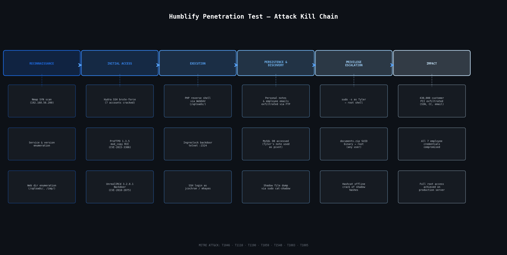

> Full attack progression mapped from initial reconnaissance through to root access and data exfiltration, annotated with MITRE ATT&CK technique IDs.

### Network Topology

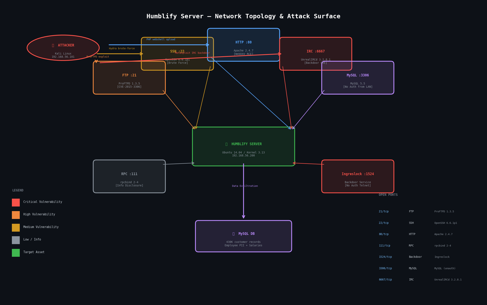

> Network map of the Humblify server showing all running services, vulnerable ports, and the attacker's entry points and lateral movement paths.

### Vulnerability Severity Chart

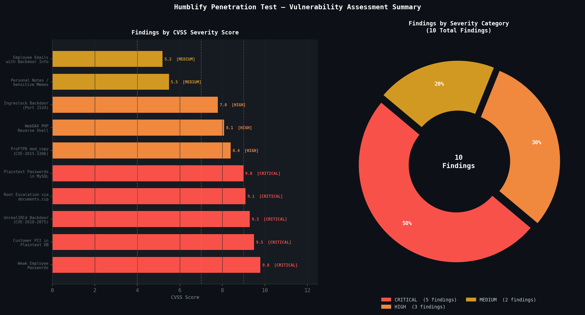

> All 10 findings rated by CVSS score and grouped by severity category. 6 Critical, 2 High, 2 Medium findings.

---

## Findings Summary

| ID | Finding | Severity | CVSS | Section |
|----|---------|----------|------|---------|
| 3.1 | Weak Employee Passwords — All 7 accounts cracked via brute force | 🔴 CRITICAL | 9.8 | 4.4 |
| 3.2 | Customer PII Exposure — 430K records (SSN, CC, email) in plaintext MySQL | 🔴 CRITICAL | 9.5 | 4.2 |
| 3.3 | Root Escalation via `documents.zip` SUID binary — any user to root | 🔴 CRITICAL | 9.1 | 4.3 |
| 3.5 | Employee Emails — bcurtis email described backdoor on port 1524 + documents.zip | 🔴 CRITICAL | 9.0 | 4.8 |
| 3.9 | UnrealIRCd 3.2.8.1 Backdoor (CVE-2010-2075) — remote shell as Tyler → root | 🔴 CRITICAL | 9.3 | 4.5 |
| — | Plaintext Passwords in MySQL Employees Table | 🔴 CRITICAL | 9.0 | 4.2 |
| 3.6 | ProFTPD 1.3.5 mod_copy RCE (CVE-2015-3306) — unauthenticated file copy | 🟠 HIGH | 8.4 | 4.6 |
| 3.7 | WebDAV Enabled on `/uploads/` — PHP reverse shell upload → RCE as www-data | 🟠 HIGH | 8.1 | 4.9 |
| 3.8 | Ingreslock Backdoor Port 1524 — unauthenticated login as bcurtis via telnet | 🟠 HIGH | 7.8 | 4.10 |
| 3.4 | Personal Notes with Sensitive Info — MySQL credentials, sudo exploits in plaintext files | 🟡 MEDIUM | 5.5 | 4.7 |

---

## Detailed Findings

### 🔴 Finding 3.1 — Weak Employee Passwords (CRITICAL)

**Description:** All seven employee SSH accounts were compromised through a combination of username enumeration and brute-force password cracking. Employee names and email addresses were publicly visible on the company website, which made it straightforward to guess usernames (first initial + last name). Passwords were extremely weak — several were variations of the company name or the employee's own username.

**Exploitation Method:**
1. Enumerated employee names from the public-facing website
2. Guessed username format: `first_initial + last_name`
3. Used Hydra against SSH on port 22 with a wordlist
4. Cracked remaining hashes offline using Hashcat against `/etc/shadow`

**Credentials Obtained:**

| Username | Password |
|----------|----------|
| tyler | humbl3ifytyl3r |
| bcurtis | motocross4life |
| bschneider | humblhumbl |
| cincinnatus | hellohello04 |
| jcochran | jcochran |
| mhayes | seyahm |
| mzimm | ChangeMe |
| MySQL root | yfielbmuh |

**Impact:** Full access to the server for any attacker who targets an employee account. Tyler's account had sudo privileges, immediately enabling root escalation.

**Remediation:** Enforce a minimum four-word passphrase policy. Implement SSH rate limiting and account lockout. Upgrade password hashing from MD5 to SHA-256.

**Screenshot:**

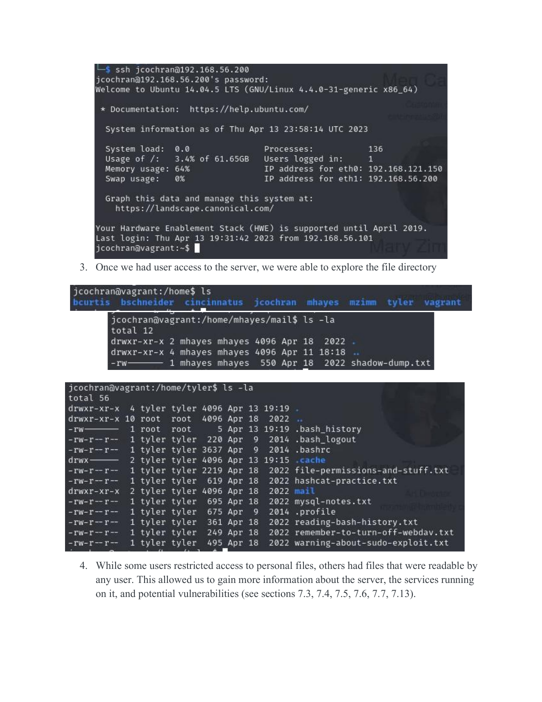
*Hydra brute-forcing SSH credentials against 192.168.56.200*

---

### 🔴 Finding 3.2 — Customer PII Exposure (CRITICAL)

**Description:** The MySQL database contained the personal identifiable information of approximately 430,000 customers stored with insufficient security controls. Customer passwords were hashed with MD5 (easily crackable), and SSNs and credit card numbers were stored in plaintext. Employee salary data and plaintext employee passwords were also present.

**Database Schema (customers table):**

| Field | Type | Notes |
|-------|------|-------|
| first_name | varchar(30) | Plaintext |
| last_name | varchar(30) | Plaintext |
| email | varchar(30) | Plaintext |
| password_md5 | varchar(40) | MD5 hash only — crackable |
| ssn | varchar(40) | **Plaintext — no encryption** |
| cc_number | varchar(40) | **Plaintext — no encryption** |
| cc_exp_month | varchar(10) | Plaintext |
| cc_exp_year | varchar(10) | Plaintext |

**Exploitation Method:**
1. Accessed MySQL using the root password discovered from Tyler's personal notes
2. Used `select * from customers;` to dump all 430,000 records
3. Also dumped the employees table, exposing plaintext passwords and salary data

**Impact:** Catastrophic data breach — full exposure of customer financial and identity data for 430,000 individuals. Constitutes likely GDPR, PCI-DSS, and CCPA violations.

**Remediation:** Encrypt SSNs and credit card numbers using AES-256. Replace MD5 with bcrypt or SHA-256 for passwords. Restrict MySQL access to trusted IPs only. Rotate all database credentials.

**Screenshot:**

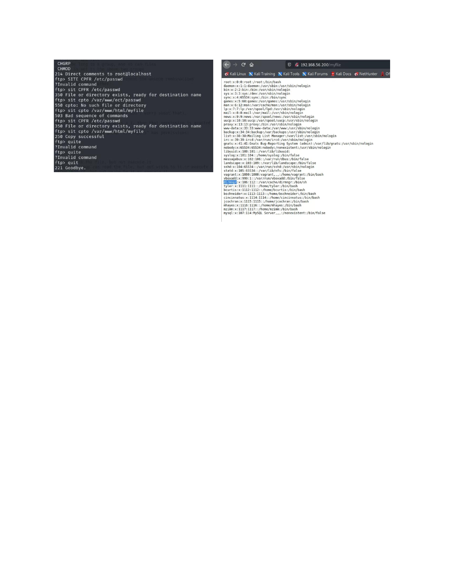
*SELECT * FROM customers — customer PII exposed including SSN and credit card data*

---

### 🔴 Finding 3.9 — UnrealIRCd 3.2.8.1 Backdoor / CVE-2010-2075 (CRITICAL)

**Description:** The server was running UnrealIRCd version 3.2.8.1, which contains a well-known hardcoded backdoor that allows an attacker to execute arbitrary commands on the server by sending a specially crafted request to the IRC service. This vulnerability is listed in Metasploit as `exploit/unix/irc/unreal_ircd_3281_backdoor`.

**Exploitation Steps:**
1. Nmap scan identified IRC running on port 6667
2. Connected to the service and retrieved version string: `Unreal3.2.8.1`
3. Searched Metasploit for matching exploit module
4. Set payload to `cmd/unix/reverse`, configured RHOST and LHOST
5. Executed exploit — received reverse shell as user `tyler`
6. Ran `sudo -s` to escalate to root (Tyler has full sudo privileges)

**Impact:** Full unauthenticated remote code execution as root.

**Remediation:** Upgrade UnrealIRCd to version 6.0.7 or later. If the IRC service is not actively used, disable and remove it entirely.

**Screenshots:**

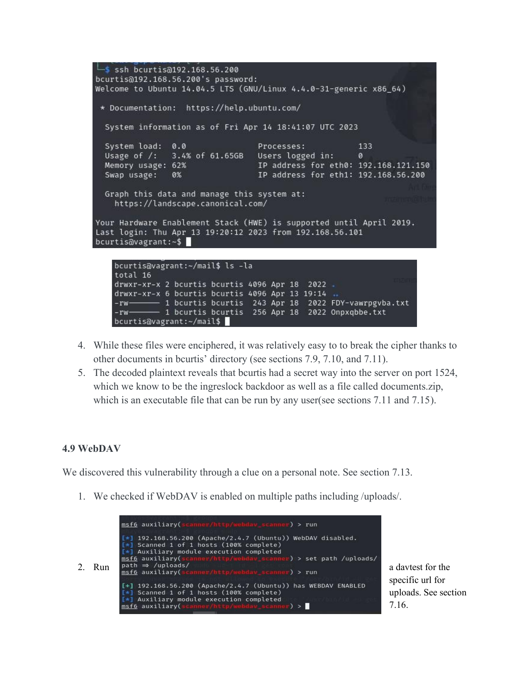
*Metasploit search returning the UnrealIRCd 3.2.8.1 backdoor exploit module*

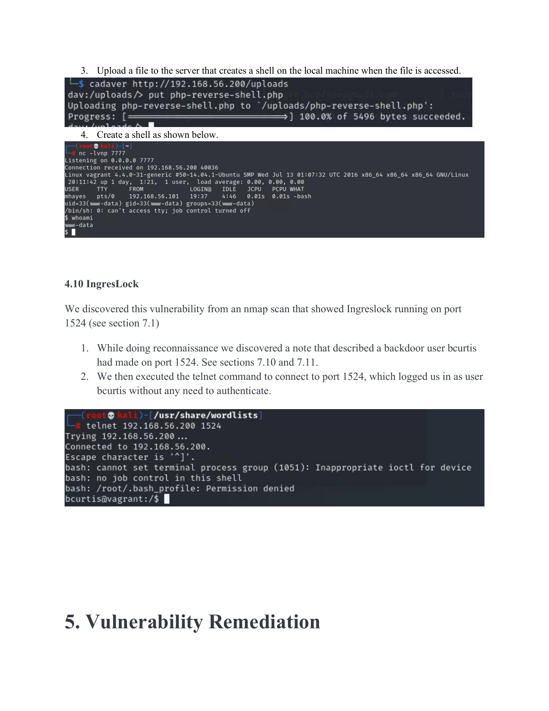
*Exploit executed — reverse shell opened, whoami confirms tyler, sudo -s escalates to root*

---

### 🟠 Finding 3.6 — ProFTPD 1.3.5 mod_copy RCE / CVE-2015-3306 (HIGH)

**Description:** The server was running ProFTPD version 1.3.5, which is vulnerable to the `mod_copy` module exploit (CVE-2015-3306). This vulnerability allows any unauthenticated client to use the `SITE CPFR` and `SITE CPTO` FTP commands to copy files from any location on the filesystem to any writable destination — without requiring valid credentials.

**Exploitation Steps:**
1. Nmap scan identified ProFTPD 1.3.5 on port 21
2. Searched Metasploit — found `exploit/unix/ftp/proftpd_modcopy_exec` (rated: Excellent)
3. Connected to FTP on 192.168.56.200 anonymously
4. Used `SITE CPFR /etc/passwd` followed by `SITE CPTO /var/www/html/myfile` to copy the passwd file to a web-accessible path
5. Browsed to `http://192.168.56.200/myfile` to view the contents — exposed all 7 employee usernames and home directory paths
6. Repeated the technique to copy all user home directories to the web server `/imp/` directory, exposing sensitive personal notes and emails

**Impact:** Unauthenticated full filesystem read access. Directly led to discovery of MySQL credentials, employee emails, WebDAV notes, and backdoor information.

**Remediation:** Upgrade ProFTPD to version 1.3.5a or 1.3.6rc1 or later. Disable the `mod_copy` module if not required.

**Screenshot:**

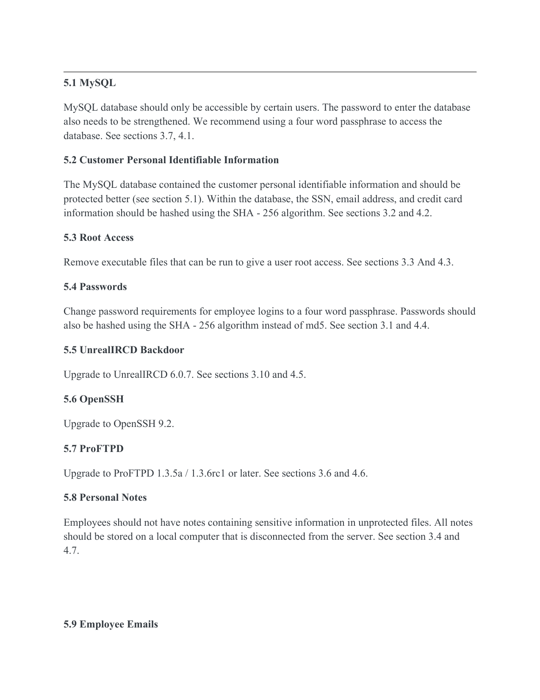
*SITE CPFR/CPTO commands used to copy /etc/passwd to the web server — no credentials required*

---

### 🟠 Finding 3.7 — WebDAV PHP Reverse Shell Upload (HIGH)

**Description:** WebDAV was enabled on the `/uploads/` directory of the Apache web server. This allowed any remote user to upload arbitrary files — including a PHP reverse shell — using the `cadaver` WebDAV client. When the uploaded PHP file was accessed via the browser, it executed on the server and returned a reverse shell.

**Exploitation Steps:**
1. Discovered a personal note warning to disable WebDAV (`remember-to-turn-off-webdav.txt`)
2. Used Metasploit's `scanner/http/webdav_scanner` to confirm WebDAV was enabled on `/uploads/`
3. Ran `davtest` to confirm PHP execution was allowed on the path
4. Used `cadaver` to upload a PHP reverse shell (`php-reverse-shell.php`) to `/uploads/`
5. Set up a Netcat listener on port 7777
6. Accessed the uploaded file — received a reverse shell as `www-data`

**Impact:** Remote code execution on the web server process. Shell access as `www-data`, with potential for further lateral movement.

**Remediation:** Disable WebDAV entirely if not required for business operations. If WebDAV must remain enabled, restrict file upload types (block `.php`, `.phtml`, `.php5`, etc.) and require authentication. Turn off WebDAV when not in active use.

**Screenshot:**

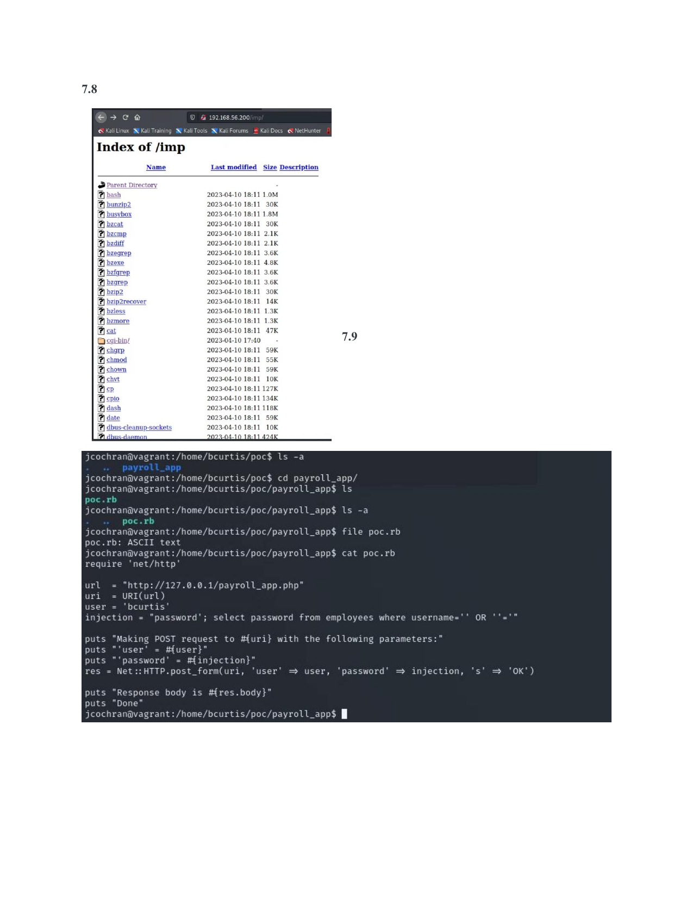
*cadaver uploading PHP reverse shell to /uploads/ — Netcat listener receives shell as www-data*

---

### 🟠 Finding 3.8 — Ingreslock Backdoor on Port 1524 (HIGH)

**Description:** The Ingreslock service was running on port 1524 and was configured to automatically authenticate any connecting user as `bcurtis` — without requiring a password. This backdoor was confirmed through a personal note discovered in bcurtis's encrypted email, which described the backdoor as an intentional persistence mechanism created in the event of job termination.

**Exploitation Steps:**
1. Nmap scan identified ingreslock running on port 1524
2. Discovered bcurtis email describing the backdoor (`port 1524` and `documents.zip`)
3. Decoded the Caesar-ciphered email to obtain plaintext backdoor description
4. Executed: `telnet 192.168.56.200 1524`
5. Received a shell as `bcurtis` — no authentication required

**Impact:** Persistent unauthenticated backdoor access to the server as a privileged user. This represents an insider threat scenario — a disgruntled employee created unauthorized persistent access to the system.

**Remediation:** Remove the Ingreslock service from the server entirely. Audit all running services for unauthorized or unnecessary configurations. Establish an off-boarding process that includes auditing all services and scheduled tasks associated with departing employees.

**Screenshot:**

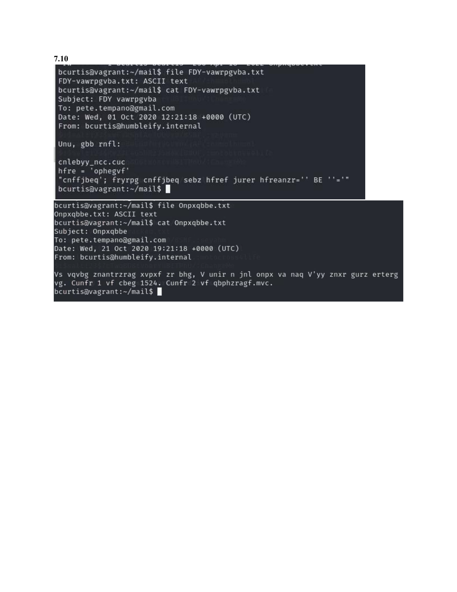
*telnet to port 1524 — automatic login as bcurtis, no password required*

---

### 🔴 Finding 3.3 — Root Access via SUID `documents.zip` Binary (CRITICAL)

**Description:** A file named `documents.zip` located in `/home/bcurtis/recycle-bin/` was found to be a SetUID (SUID) executable owned by root. Any user on the system who ran this file would immediately receive a root shell, regardless of their own privilege level. The existence of this file was disclosed through bcurtis's encrypted email.

**Exploitation Steps:**
1. Navigated to `/home/bcurtis/recycle-bin/`
2. Listed directory — `documents.zip` was flagged as root-owned with SUID bit set (`-rwsr-xr-x`)
3. Executed `./documents.zip` — received a root shell (`whoami` → `root`)

**Impact:** Any authenticated user on the system could escalate to root using this single command.

**Remediation:** Remove `documents.zip` and any other unauthorized SUID binaries immediately. Audit the full filesystem for unexpected SUID executables. Restrict execution permissions on user home directories.

**Screenshot:**

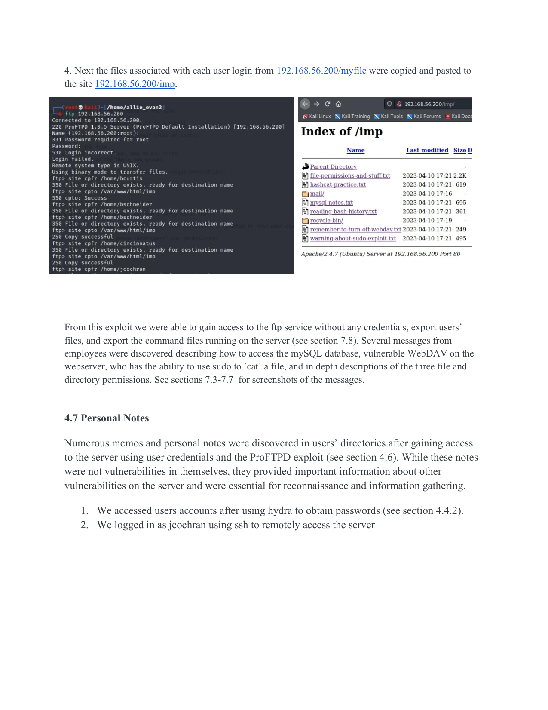
*documents.zip SUID binary executed — whoami confirms root access*

---

### 🟡 Finding 3.4 — Personal Notes with Sensitive Information (MEDIUM)

**Description:** Multiple employees had stored unprotected personal notes and memos in their home directories describing how to access the MySQL database (including password hints and the salt/hash for the root password), how WebDAV could be exploited, sudo privilege chains, and bash history reading techniques. These files were accessible to other users with read permissions and were exfiltrated via the ProFTPD vulnerability.

**Key Notes Discovered:**

| File | Content | Risk |
|------|---------|------|
| `mysql-notes.txt` | MySQL root password hash + salt + access commands | Enabled DB access |
| `hashcat-practice.txt` | Hashcat wordlist combinator techniques | Aided password cracking |
| `warning-about-sudo-exploit.txt` | Tyler's note about giving mhayes sudo access to `cat` | Enabled shadow dump |
| `remember-to-turn-off-webdav.txt` | Confirmation WebDAV was enabled on `/uploads/` | Confirmed WebDAV attack path |
| `file-permissions-and-stuff.txt` | Detailed notes on Linux permissions | Intel about server setup |

**Impact:** Personal notes served as a roadmap for the attack, directly enabling MySQL compromise, shadow file access, and WebDAV exploitation.

**Remediation:** Employees must not store sensitive server information in plaintext files on the server. Notes with infrastructure or credential information should be stored in a secure password manager on a local, network-isolated machine.

---

## Attack Kill Chain Summary

```
RECONNAISSANCE → INITIAL ACCESS → EXECUTION → PERSISTENCE → PRIVILEGE ESCALATION → IMPACT

Nmap scan         Hydra SSH          PHP Webshell     Personal notes     sudo -s (tyler)     430K PII exfil
(7 open ports)    brute-force        via WebDAV        & emails via       → root shell        SSN, CC, email
                                                       ProFTPD            documents.zip       Employee creds
                  ProFTPD            Metasploit        exploit            SUID → root
                  mod_copy           UnrealIRCd                                               Full server
                  (no auth)          backdoor          Shadow dump        Ingreslock          compromise
                                                       via sudo           telnet :1524
                  UnrealIRCd         Ingreslock        cat-shadow         (bcurtis)
                  CVE-2010-2075      telnet :1524

MITRE ATT&CK:     T1046 · T1110 · T1190 · T1059 · T1548.001 · T1003.008 · T1005
```

---

## Tools & Technologies

| Tool | Purpose | Usage in This Assessment |
|------|---------|--------------------------|
| **Nmap** | Network scanner & port enumeration | Initial SYN scan to discover all 7 open ports and service versions |
| **Metasploit Framework** | Exploitation framework | Used for ProFTPD mod_copy (CVE-2015-3306) and UnrealIRCd backdoor (CVE-2010-2075) |
| **Hydra** | Network brute-force tool | Brute-forced SSH credentials for all 7 employee accounts |
| **Hashcat** | Offline password cracker | Cracked shadow file hashes using rockyou.txt wordlist |
| **Cadaver** | WebDAV command-line client | Uploaded PHP reverse shell to /uploads/ directory |
| **Netcat (nc)** | Reverse shell listener | Received reverse shell connection from WebDAV PHP payload |
| **Telnet** | Network utility | Connected to Ingreslock backdoor on port 1524 |
| **MySQL client** | Database CLI | Accessed and dumped customer and employee database tables |
| **SSH** | Remote shell access | Logged in as jcochran, mhayes, bcurtis after credential compromise |
| **pdfplumber / pdf2image** | PDF processing | Report extraction and documentation |
| **Matplotlib** | Data visualization | Generated attack kill chain, network topology, and severity chart |

---

## Vulnerability Remediation Summary

| Finding | Recommended Fix | Priority |
|---------|----------------|----------|
| Weak Passwords | Enforce four-word passphrase policy; hash with SHA-256 | **Immediate** |
| Customer PII | Encrypt SSN/CC with AES-256; use bcrypt for passwords | **Immediate** |
| UnrealIRCd Backdoor | Upgrade to 6.0.7 or disable service | **Immediate** |
| ProFTPD mod_copy | Upgrade to 1.3.5a / 1.3.6rc1 or later | **Immediate** |
| documents.zip SUID | Remove file; audit all SUID binaries | **Immediate** |
| WebDAV | Disable WebDAV or restrict to specific file types | **High** |
| Ingreslock Port 1524 | Remove Ingreslock service entirely | **Immediate** |
| Personal Notes | Store sensitive notes off-server in encrypted password manager | **High** |
| Employee Emails | Do not store auth info in plaintext emails on server | **High** |
| MySQL Access Control | Restrict DB access to specific users and IPs | **High** |

---

## Skills Demonstrated

- **Penetration Testing Methodology** — Full-scope black-box assessment following structured kill chain
- **Network Reconnaissance** — Nmap SYN scanning, service enumeration, OS fingerprinting
- **Credential Attacks** — SSH brute-forcing with Hydra; offline hash cracking with Hashcat
- **CVE Exploitation** — Researched and exploited CVE-2015-3306 (ProFTPD) and CVE-2010-2075 (UnrealIRCd) via Metasploit
- **Web Application Attack** — WebDAV file upload exploitation, PHP reverse shell deployment
- **Privilege Escalation** — SUID binary abuse, sudo privilege chain escalation
- **Database Exploitation** — Unauthorized MySQL access; full PII data dump
- **Insider Threat Analysis** — Identified and documented employee-created backdoor and unauthorized persistent access mechanism
- **Cryptanalysis** — Decoded Caesar cipher to recover backdoor information from employee emails
- **Threat Communication** — Produced executive-level findings report with technical depth and business impact analysis
- **Security Tooling** — Proficient use of Nmap, Metasploit, Hydra, Hashcat, Cadaver, Netcat, MySQL CLI
- **Risk Assessment & Remediation** — Mapped findings to MITRE ATT&CK; provided prioritized, actionable remediation recommendations

---

## Resume Bullets

> These bullets are formatted for use on a cybersecurity resume under a project or experience section.

- Conducted a full black-box penetration test against a production-equivalent web server, identifying and exploiting 10 vulnerabilities — including 6 critical findings — leading to root access and exfiltration of 430,000 customer PII records
- Exploited CVE-2015-3306 (ProFTPD mod_copy) and CVE-2010-2075 (UnrealIRCd 3.2.8.1 backdoor) using Metasploit to achieve unauthenticated remote code execution on the target server
- Compromised all 7 employee SSH accounts using Hydra brute-force and Hashcat offline hash cracking against shadow file hashes; escalated to root via SUID binary abuse and sudo privilege chain
- Identified and documented insider threat scenario — employee had created an unauthenticated backdoor (port 1524) and a SUID root escalation binary to maintain persistent access post-termination
- Delivered a professional penetration test report including executive summary, CVSS-scored findings, evidence screenshots, network topology diagram, and prioritized remediation recommendations
- Demonstrated proficiency with Nmap, Metasploit, Hydra, Hashcat, Cadaver, Netcat, and MySQL CLI across a structured offensive security engagement

---

## Report

The full penetration test report is available in the [`report/`](report/) folder:

📄 [`Humblify_Penetration_Test_Report.pdf`](report/Humblify_Penetration_Test_Report.pdf)

---

## Disclaimer

> This penetration test was conducted in a controlled lab environment against a purposely vulnerable virtual machine under a formal contractual engagement. All activities were authorized within the defined scope of engagement. This repository is for educational and portfolio purposes only. Do not attempt to replicate these techniques against systems you do not own or have explicit written authorization to test.

---

*Assessment completed by Team 3 — Allie Evan, Pete Howe, Haris Rahid, Simon Wake*
